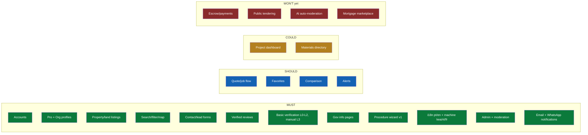

# Ilhavista — Product Requirements Document (PRD)

**Document:** 07 — Product Requirements
**Status:** Draft for validation
**Last updated:** 2026-07-20
**Owner:** Product / UX
**Canonical source:** `docs/canon.md` (Ilhavista Project Canon). This PRD must remain consistent with the canon at all times; where they diverge, the canon wins.

> **Reliability labels used throughout:** **FACT** (confirmed source) · **ASSUMPTION** (single/indirect source) · **HYPOTHESIS** (reasoned guess) · **RECOMMENDATION** (our advice). Legal, tax, government and market items are flagged "To validate" where confirmation is still required. We never invent laws, rates, market sizes, partners or contacts.

---

## 1. Product overview

### 1.1 What Ilhavista is

**Ilhavista** is independent digital infrastructure connecting citizens, professionals, investors and public bodies for property, building and public information in Cabo Verde. It is **trust-first, not just a listings site**. (FACT — canon positioning.)

The product delivers **five value layers** (FACT — canon):

| # | Value layer | What it means for the user |
|---|-------------|----------------------------|
| 1 | **Information** | Reliable property, land, building and public-procedure information, multilingual, with clear provenance. |
| 2 | **Trust** | Verified people, businesses, documents and reviews; badges that paid visibility can never buy. |
| 3 | **Findability** | Search, filter and map to find property, land, professionals and suppliers. |
| 4 | **Transactions / jobs** | Contact, leads, quotes and jobs between clients and professionals. |
| 5 | **Process guidance** | Step-by-step guidance through official procedures (procedure wizard, concierge support). |

### 1.2 Positioning statement

> "The digital gateway to property, building and public information in Cabo Verde." (EN tagline — canon.)
> "A porta digital para terra, construção e serviços em Cabo Verde." (PT tagline — canon.)

### 1.3 Ambition / rollout

Pilot on **São Vicente (Mindelo)** → multi-island → national → export to comparable island states. (FACT — canon ambition.) Mindelo is the cultural capital and São Vicente is among the islands first explored by international buyers (ASSUMPTION/med — canon fact #7).

---

## 2. Product goals

| Goal | Description | Success signal (to baseline in pilot) |
|------|-------------|----------------------------------------|
| G1 — Trustworthy information | Be the most reliable single source for property/land + public-procedure information in Cabo Verde. | Users report information as trustworthy; low correction/dispute rate. (Market validation required.) |
| G2 — Verified marketplace | Connect clients with **verified** professionals and businesses. | Share of active professionals at L1–L3; job-lead conversion. |
| G3 — Process guidance | Reduce confusion and risk in official procedures via the procedure wizard + concierge. | Wizard completion rate; concierge tickets resolved. |
| G4 — Mobile-first access | Usable on low-end phones and slow/intermittent connections. | Performance budgets met on 3G; PWA install/return rate. |
| G5 — Multilingual inclusion | Serve pt / kea / en / nl / fr users with clear source-vs-translation provenance. | Language coverage of core content; kea usage. |
| G6 — Government partnership path | Move from informal info partner → official publication partner → PPP. | Signed information partner(s); official pages published. (Government confirmation required.) |

**Non-goals for MVP** (WON'T yet — canon): full escrow/payments, public tendering, AI auto-moderation without a human, mortgage marketplace.

---

## 3. Target users

Ilhavista serves both sides of the marketplace plus public institutions. Roles below are the canon roles; Section 8 maps them to permissions.

### 3.1 Primary personas (MVP)

| Persona | Canon role(s) | Context (Cabo Verde reality) | Primary need |
|---------|---------------|------------------------------|--------------|
| **Local property seeker / seller** | buyer, seller, registered user | Mobile-first; may use kea/pt; informal market with word-of-mouth. | Find/list property & land; contact trusted counterpart. |
| **Diaspora & foreign buyer/investor** | buyer, investor | Abroad (NL/FR/PT diaspora, tourism buyers on Sal/Boa Vista/São Vicente); needs en/nl/fr; unfamiliar with procedures. | Understand how to buy/build safely; find verified professionals. |
| **Professional / tradesperson** | professional | Architects, engineers, builders, electricians, plumbers, surveyors; often informal, phone-based, WhatsApp-driven. | Get found, build reputation, win jobs. |
| **Business / agency** | business admin, agent (makelaar), developer (projectontwikkelaar) | Real-estate agencies, construction firms, developers, material suppliers. | Manage org profile, listings, staff, leads. |
| **Client / commissioner** | client (opdrachtgever) | Person commissioning building/renovation work. | Post a job, compare quotes, leave a verified review. |
| **Government editor / approver** | gov editor, gov approver | Public bodies (e.g. municipalities, INGT, Casa do Cidadão) publishing official procedure info. | Publish accurate, versioned official information. (Government confirmation required.) |
| **Platform operations** | moderator, verification specialist, support, admins | Ilhavista team running concierge-first operations. | Moderate, verify, support, run the platform. |

### 3.2 Connectivity reality (FACT, high — canon fact #1, DataReportal Digital 2025: Cabo Verde, Jan 2025)

- Internet users **387k = 73.5%** penetration.
- Mobile connections **604k = 115%** of population.
- Social media users **262k = 49.9%**.

**Implication (RECOMMENDATION):** design mobile-first, WhatsApp-oriented, low-bandwidth tolerant; do not assume desktop or fast fixed broadband.

---

## 4. Platform modules A–H

Each module below states **purpose**, **key features**, and **MVP vs later** classification consistent with the canon MoSCoW scope (Section 6).

### Module A — Property & land

- **Purpose:** Findable, trustworthy listings of property and building/development land across the islands.
- **Key features:** create/manage listings; photos + map (PostGIS); search/filter/map; contact/lead form; premium listing + labelled featured placement; listing verification (L0–L3).
- **MVP:** **MUST** — listings, search/filter/map, contact/lead forms. **Later:** favorites, comparison, saved-search alerts (SHOULD).
- **Reality note:** distinguish land types; agricultural land ownership is conditional for foreigners (FACT/med — canon fact #3, legal verification required).

### Module B — Professionals & businesses

- **Purpose:** Directory of verified professionals and organizations (agencies, construction firms, developers, suppliers).
- **Key features:** professional profile; organization profile with staff; specialities/service areas; verification badges (L1–L3); subscription tiers (Free / Pro / Business).
- **MVP:** **MUST** — professional + organization profiles, basic verification.
- **Reality note:** company formation via **"Empresa no Dia" / Casa do Cidadão**, registry via **EASE** (FACT/med-high — canon fact #6) — useful for L2/L3 evidence.

### Module C — Reviews & trust

- **Purpose:** Reputation you can rely on; reviews tied to real, completed work.
- **Key features:** **verified reviews** (linked to a completed job/lead, L4 signal); ratings; response-by-professional; moderation; anti-abuse.
- **MVP:** **MUST** — verified reviews + moderation.
- **Rule (FACT — canon):** paid visibility never buys review scores.

### Module D — Government information

- **Purpose:** Plain-language + official public information about property, land and building procedures.
- **Key features:** government info pages; official source text preserved with provenance; plain-language summaries; versioning; multilingual linking.
- **MVP:** **MUST** — government info pages (concierge/manual authoring first). **Later:** official publication partner SLA (Government confirmation required).
- **Reality note:** unified portal **gov.cv** launched 24 Feb 2026; **CMDCV** e-signature via Autentika; **NOSi** runs e-gov backbone (FACT — canon fact #2).

### Module E — Procedure wizard

- **Purpose:** Guide a user through an official procedure end-to-end (steps, authorities, documents, professionals, risks, costs, timeline, checklist).
- **Key features:** guided intake (island, goal, actor type) → generated plan referencing government-info content and verified professionals; downloadable/printable checklist; concierge hand-off.
- **MVP:** **MUST** — procedure wizard **v1** (manual/concierge-backed content).
- **Reality note:** wizard content must cite validated sources and flag "Legal/Government verification required"; never invent laws or rates.

### Module F — Construction project management

- **Purpose:** Help a client and professionals track a building/renovation project.
- **Key features:** project dashboard; milestones; documents; participants; status.
- **MVP:** **COULD** (project dashboard) — later phase, not MVP-critical.
- **Business tie-in:** project-management add-on (canon business model).

### Module G — Tenders & jobs

- **Purpose:** Post jobs, receive and compare quotes; connect clients to professionals.
- **Key features:** post a job/request; receive quotes; compare; award/contact; (later) facilitated-job take rate + escrow.
- **MVP:** **SHOULD** — quote/job flow. **WON'T yet:** public tendering, full escrow/payments.
- **Reality note:** facilitated-job take rate (target 5–10%) only after escrow exists (canon).

### Module H — Building materials & suppliers

- **Purpose:** Directory of building-material suppliers and their catalogue/availability.
- **Key features:** supplier directory; product/material categories; contact; (later) pricing/availability.
- **MVP:** **COULD** — materials directory. Not MVP-critical.

### 4.1 Module → MoSCoW quick map

| Module | Name | MVP classification |
|--------|------|--------------------|
| A | Property & land | MUST (listings, search/map, leads) |
| B | Professionals & businesses | MUST (profiles, verification) |
| C | Reviews & trust | MUST (verified reviews, moderation) |
| D | Government information | MUST (info pages) |
| E | Procedure wizard | MUST (wizard v1) |
| F | Construction project management | COULD (dashboard, later) |
| G | Tenders & jobs | SHOULD (quote/job flow) |
| H | Building materials & suppliers | COULD (directory, later) |

---

## 5. Cross-cutting product principles

1. **Trust-first, concierge-first (FACT — canon):** verification, listing intake, onboarding, matchmaking, procedure guidance and WhatsApp support are **manual first**, productized later.
2. **Provenance of language (FACT — canon):** always distinguish professional translation vs machine translation vs official government text vs plain-language summary; official source texts always preserved and linked.
3. **Labelled paid visibility (FACT — canon):** featured/sponsored placement always labelled "Patrocinado/Sponsored"; paid visibility never buys verification, review scores, or manipulation of official info.
4. **Mobile-first, low-bandwidth (RECOMMENDATION grounded in canon fact #1):** performance budgets for 3G; PWA; offline-tolerant reads.
5. **Data minimisation & privacy (ASSUMPTION — canon fact #8, legal verification required):** align with Cabo Verde's RGPD-aligned regime under **CNPD**; confirm exact obligations with counsel.

---

## 6. MVP scope — MoSCoW (exactly per canon)

### MUST
Accounts; professional + organization profiles; property/land listings; search/filter/map; contact/lead forms; verified reviews; basic verification (**L0–L2, manual L3**); government info pages; procedure wizard **v1**; i18n (**pt/en human + machine kea/nl/fr**); admin + moderation; **email + WhatsApp-oriented** notifications.
Concierge (manual first): verification, listing intake, onboarding, matchmaking, procedure guidance, WhatsApp support.

### SHOULD
Quote/job flow; favorites; comparison; alerts.

### COULD
Project dashboard; materials directory.

### WON'T (yet)
Full escrow/payments; public tendering; AI auto-moderation without human; mortgage marketplace.

---

## 7. Non-functional requirements (summary)

Full NFRs (with IDs) live in `docs/09-functional-requirements.md`. Summary here for stakeholder review.

| Area | Requirement (target) | Rationale |
|------|----------------------|-----------|
| **Performance (slow connections)** | Core pages usable on 3G; performance budget: initial route JS ≤ ~200 KB gzip (HYPOTHESIS — to tune); image lazy-loading + responsive sizes; server-render key content; cache with Redis. Time-to-interactive target ≤ 5 s on emulated 3G (HYPOTHESIS — to validate). | Canon fact #1: mobile-first, high mobile penetration, variable bandwidth. |
| **Accessibility** | **WCAG 2.1 AA** (FACT — canon tech stack). | Inclusion; legal-friendly. |
| **Security** | Email + phone (OTP) auth, MFA, RBAC, session mgmt, device monitoring; malware scan on upload; signed URLs; least privilege. (FACT — canon.) | Trust-first platform. |
| **Privacy** | RGPD-aligned; CNPD regime; data minimisation; consent; retention policy. (ASSUMPTION — canon fact #8; legal verification required.) | Personal data of citizens + foreigners. |
| **i18n** | pt (base), kea, en, nl, fr; source-vs-translation provenance. (FACT — canon.) | Multilingual population + diaspora + tourism buyers. |
| **Availability** | Environments dev/test/staging/prod; backups, monitoring, logging, IR, DR. (FACT — canon.) Pilot availability target ≥ 99.5% (HYPOTHESIS — to set SLA). | Reliable public infrastructure. |
| **Observability** | Structured logging, metrics, error tracking. (RECOMMENDATION, aligned to canon monitoring/logging.) | Operability at pilot scale. |

---

## 8. Roles → permissions (RBAC overview)

Canon roles, mapped to representative permissions. RBAC is enforced (FACT — canon). Legend: **C** create · **R** read · **U** update · **D** delete · **A** approve/moderate · **—** none. "Own" = only own records.

| Role | Listings (A) | Pro/Org profile (B) | Reviews (C) | Gov info (D) | Wizard (E) | Jobs/Quotes (G) | Verification | Moderation | Admin/Config |
|------|:---:|:---:|:---:|:---:|:---:|:---:|:---:|:---:|:---:|
| visitor | R | R | R | R | R | — | — | — | — |
| registered user | R | R (own C) | C (own) | R | R/C | C (own) | request | — | — |
| buyer | R | R | C (own, verified) | R | R/C | C (own) | request | — | — |
| seller | C/R/U/D (own) | R (own C) | R | R | R | R | request | — | — |
| investor | R | R | C (own, verified) | R | R/C | C (own) | request | — | — |
| client (opdrachtgever) | R | R | C (own, verified) | R | R/C | C/R/U (own jobs) | request | — | — |
| professional | C/R/U/D (own) | C/R/U (own) | R + respond (own) | R | R | R + quote | request | — | — |
| business admin | C/R/U/D (org) | C/R/U/D (org + staff) | R + respond (org) | R | R | C/R/U (org) | request (org) | — | org settings |
| agent (makelaar) | C/R/U/D (org/own) | R/U (own) | R + respond | R | R | R + quote | request | — | — |
| developer (projectontwikkelaar) | C/R/U/D (own/org) | C/R/U (own) | R + respond | R | R | C/R/U | request | — | project mgmt (later) |
| gov editor | — | — | R | C/R/U (draft) | R | — | — | — | — |
| gov approver | — | — | R | A (approve/publish) | R | — | — | — | — |
| moderator | R + hide | R + flag | A (approve/remove) | R | R | R | R | A | — |
| verification specialist | R | R + set badge | R | R | R | R | C/R/U/A (L0–L5) | — | — |
| support | R | R | R | R | R | R | R (assist) | R | limited |
| finance admin | R | R | R | R | — | R (fees/subs) | R | — | billing config |
| platform admin | C/R/U/D | C/R/U/D | A | R | C/R/U | C/R/U/D | A | A | platform config |
| superadmin | full | full | full | full | full | full | full | full | full |

> **RECOMMENDATION:** implement as permission-based RBAC (roles → permission sets) so composite users (e.g. a professional who is also a seller) accumulate permissions. Gov editor/approver enforce **separation of duties** (editor drafts, approver publishes — see Module D flow).

---

## 9. Data fields — Module A (property/land listing)

Fields for the MVP listing. Types are indicative; validation lives in `@ilhavista/validation`. "Req?" = required at publish.

| Field | Type | Req? | Notes |
|-------|------|:---:|-------|
| id | uuid | system | — |
| listingType | enum {sale, rent} | yes | MVP focus: sale + rent. |
| propertyKind | enum {apartment, house, land, commercial, other} | yes | Land is first-class (Module A land focus). |
| landUse | enum {residential, tourism, commercial, development, agricultural} | conditional | Required when propertyKind=land. Agricultural = foreign-ownership caveat (canon fact #3). |
| title | string (localizable) | yes | Provenance-aware per language. |
| description | text (localizable) | yes | Machine vs human translation labelled. |
| priceCVE | integer (CVE) | yes | Currency CVE; EUR shown via peg 110.265 (canon). |
| priceOnRequest | boolean | no | For informal-market cases. |
| island | enum (9 inhabited islands) | yes | Santiago, São Vicente, Sal, Boa Vista, Santo Antão, São Nicolau, Fogo, Maio, Brava (canon fact #7). |
| municipality | string/enum | yes | To validate against admin divisions. |
| locality / address | string | no | Optional for privacy in informal market. |
| geo (lat/lng) | PostGIS point | recommended | Map/search; may be approximate. |
| areaBuilt_m2 | number | conditional | For buildings. |
| areaLand_m2 | number | conditional | For land. |
| bedrooms | integer | conditional | Residential. |
| bathrooms | integer | conditional | Residential. |
| condition | enum {new, good, renovation-needed, off-plan} | no | — |
| features | string[] | no | e.g. sea view, parking, water/electricity connection. |
| photos | media[] (S3, scanned, signed URLs) | yes (≥1) | Malware scan on upload (canon). |
| documents | media[] | no | Title/permit docs feed L3 verification. |
| verificationLevel | enum {L0..L5} | system | Listing/owner verification (canon levels). |
| sponsored | boolean | system | If featured/premium; always labelled "Patrocinado/Sponsored". |
| premiumUntil | datetime | no | Premium listing ≈ 5.000 CVE/30d (canon). |
| ownerRef | uuid (user/org) | yes | Links to profile B. |
| status | enum {draft, pending-review, published, paused, sold/rented, rejected} | system | Moderation workflow. |
| createdAt / updatedAt | datetime | system | — |
| language provenance | metadata | system | Source language + translation type per field. |

---

## 10. Data fields — Module B (professional / organization profile)

### 10.1 Professional profile

| Field | Type | Req? | Notes |
|-------|------|:---:|-------|
| id | uuid | system | — |
| displayName | string | yes | — |
| profession / trade | enum + free text | yes | Architect, engineer, builder, electrician, plumber, surveyor, agent, etc. |
| bio | text (localizable) | no | Provenance-aware. |
| serviceAreas | island/municipality[] | yes | Where they work. |
| specialities | string[] | no | — |
| languages | enum[] {pt,kea,en,nl,fr} | no | Helps foreign clients. |
| contact (phone/WhatsApp/email) | structured | yes | WhatsApp-oriented (canon). |
| subscriptionTier | enum {Free, Pro, Business} | system | Pro ≈2.500 CVE/mo, Business ≈7.500 CVE/mo (canon). |
| verificationLevel | enum {L0..L5} | system | L1 identity → L2 activity → L3 documents. |
| badges | derived | system | From verification + completed jobs (L4). |
| ratingSummary | derived | system | From verified reviews (Module C). |
| portfolio | media[] | no | Scanned, signed URLs. |
| linkedOrg | uuid | no | Employer/agency. |
| status | enum {draft, active, suspended} | system | — |

### 10.2 Organization profile

| Field | Type | Req? | Notes |
|-------|------|:---:|-------|
| id | uuid | system | — |
| legalName / tradeName | string | yes | — |
| orgType | enum {agency, construction, developer, supplier, other} | yes | Supplier ties to Module H. |
| registration ref (NIF/registry) | string | conditional | Feeds L2/L3 (EASE / Casa do Cidadão — canon fact #6). To validate exact identifiers. |
| serviceAreas | island/municipality[] | yes | — |
| staff | user[] with org roles | no | business admin manages. |
| contact | structured | yes | — |
| subscriptionTier | enum {Free, Pro, Business} | system | — |
| verificationLevel | enum {L0..L5} | system | — |
| listings/profiles owned | refs | system | — |
| status | enum {draft, active, suspended} | system | — |

---

## 11. Verification levels (product view)

Canon verification model; each level has required evidence, validity period, re-check, badge, limits, cost, fraud risk, escalation. MVP implements **L0–L2 + manual L3**.

| Level | Meaning | MVP? | Example evidence | Badge intent |
|-------|---------|:---:|------------------|--------------|
| L0 | Not verified | yes | — | none/neutral |
| L1 | Identity / contact | yes | Verified phone (OTP) + email; ID check (concierge). | "Identity verified" |
| L2 | Business / professional activity | yes | Registry ref (EASE/Casa do Cidadão), trade evidence. | "Business verified" |
| L3 | Documents | manual (MVP) | Permits, registrations, certificates, title docs. | "Documents verified" |
| L4 | Transaction / project completed | later | Completed job/review linkage. | "Completed work" |
| L5 | Public / institutional partner | later | Gov, bank, notary partnership. | "Official partner" |

> Fees per level and re-check cadence are business-model items (canon) — **to validate**; never imply paid visibility buys a level.

---

## 12. Assumptions, risks & open questions

| # | Item | Label | Action |
|---|------|-------|--------|
| 1 | Exact municipal/admin divisions per island for listing fields. | ASSUMPTION | Validate against official sources. |
| 2 | Registry identifiers (NIF, EASE fields) for org verification. | ASSUMPTION | Confirm with Casa do Cidadão / EASE. Government confirmation required. |
| 3 | Property transfer taxation post-2026 (cITI/cIPI replacing IUP). | FACT/med-high | Reference only in wizard/gov info with "tax verification required" (canon fact #4). |
| 4 | Data-protection obligations (CNPD). | ASSUMPTION | Legal verification required (canon fact #8). |
| 5 | Government publication partnership (Module D SLA). | HYPOTHESIS | Government confirmation required. |
| 6 | Performance budgets and availability SLA numbers. | HYPOTHESIS | Baseline during pilot on São Vicente. |
| 7 | Market size / adoption. | ASSUMPTION | Market validation required. |

---

*End of PRD. See `docs/08-user-journeys.md` for flows and `docs/09-functional-requirements.md` for numbered FR/NFRs.*
