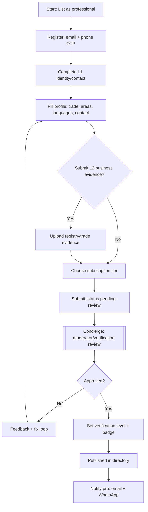
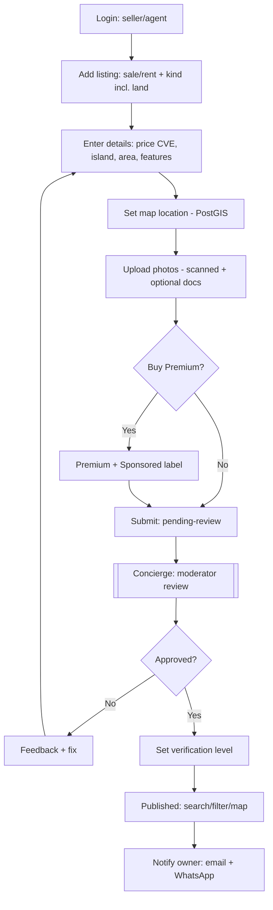
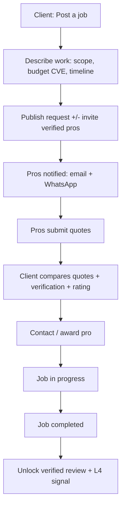
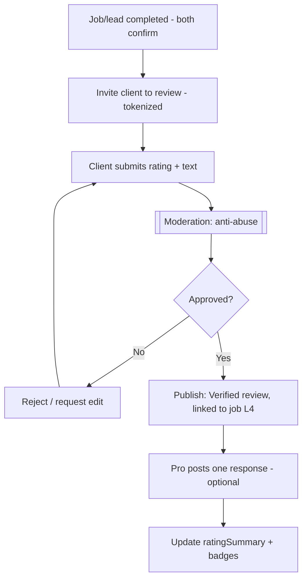
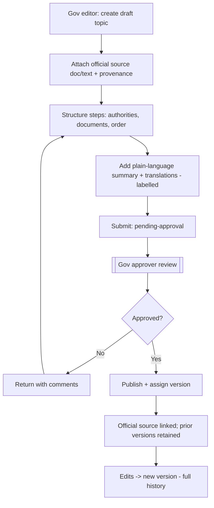
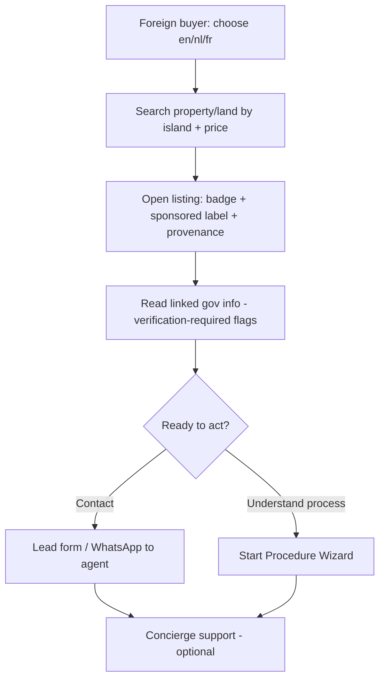
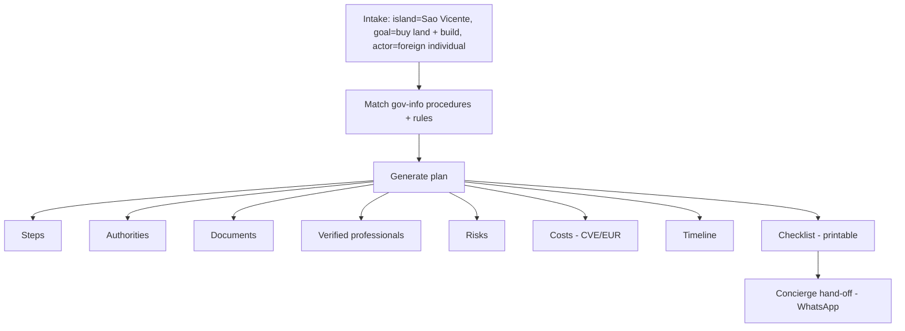

# Ilhavista — User Journeys & Flows

**Document:** 08 — User Journeys
**Status:** Draft for validation
**Last updated:** 2026-07-20
**Owner:** Product / UX
**Canonical source:** `docs/canon.md`. Must remain consistent with the canon and with `docs/07-product-requirements.md`.

> Reliability labels: **FACT / ASSUMPTION / HYPOTHESIS / RECOMMENDATION**. Legal/tax/government items flagged "verification required". Mobile-first, low-bandwidth, WhatsApp-oriented, multilingual (pt/kea/en/nl/fr).

---

## 1. Sitemap & navigation

Public PWA (`apps/web`) plus operations console (`apps/admin`). MVP modules A–H are reflected in navigation; F/H are lightweight (COULD).

```mermaid
graph TD
    Home[Home / Ilhavista]:::pub
    Home --> Prop[Property & Land — Module A]
    Home --> Pros[Professionals & Businesses — Module B]
    Home --> Gov[Government Info — Module D]
    Home --> Wiz[Procedure Wizard — Module E]
    Home --> Jobs[Jobs & Quotes — Module G]
    Home --> Mat[Materials & Suppliers — Module H]
    Home --> Acct[Account / Login]
    Home --> Lang[Language pt/kea/en/nl/fr]

    Prop --> PSearch[Search / Filter / Map]
    Prop --> PDetail[Listing detail + Contact/Lead]
    Prop --> PCreate[Create/Manage listing]

    Pros --> ProSearch[Directory search]
    Pros --> ProDetail[Profile + Reviews + Contact]
    Pros --> ProCreate[Create/Manage profile]

    Gov --> GovTopic[Procedure topic pages]
    GovTopic --> GovSource[Official source text + provenance]
    GovTopic --> GovSummary[Plain-language summary]

    Wiz --> WizIntake[Guided intake]
    WizIntake --> WizPlan[Generated plan: steps/authorities/docs/pros/risks/costs/timeline/checklist]

    Jobs --> JobPost[Post a job]
    Jobs --> JobQuotes[Receive & compare quotes]
    JobQuotes --> Review[Verified review after completion — Module C]

    Acct --> Dash[User dashboard]
    Dash --> Fav[Favorites/Alerts — SHOULD]
    Dash --> Proj[Project dashboard — COULD]

    classDef pub fill:#0b3b7a,color:#fff;
```

**Operations console (`apps/admin`)** navigation (staff roles): Moderation queue · Verification queue · Listings/Profiles review · Government content workflow · Users & roles (RBAC) · Support/concierge · Finance (subs/fees).

**Navigation principles (RECOMMENDATION, grounded in canon):**
- Language switcher always reachable; source-vs-translation clearly labelled.
- "Sponsored/Patrocinado" always labelled in listings and search.
- Verification badges visible on cards and detail pages.
- Low-bandwidth: text-first, images lazy-loaded, offline-tolerant reads.

---

## 2. Core MVP end-to-end flows

Five core flows (MUST-level scope). Each: numbered steps + Mermaid flowchart. Concierge (manual) steps are marked — canon requires concierge-first for verification, intake, onboarding, matchmaking, procedure guidance, WhatsApp support.

### Flow 1 — Professional registers & publishes profile (Module B)

1. Visitor selects "List yourself as a professional" and chooses language.
2. Registers account: email + phone with **OTP** (canon auth).
3. Completes **L1** identity/contact (verified phone/email; ID via concierge).
4. Fills professional profile (profession, service areas, specialities, languages, contact/WhatsApp).
5. Optionally submits business/registry evidence for **L2** (EASE/Casa do Cidadão ref — canon fact #6).
6. Chooses subscription tier (Free / Pro / Business).
7. Submits → status `pending-review`.
8. **Moderator/verification specialist** reviews (concierge); sets verification level + badge.
9. Profile published; appears in directory with badge; owner notified (email + WhatsApp-oriented).

### Flow 2 — Publish a property/land listing (Module A)

1. Seller/agent/registered user logs in and selects "Add listing".
2. Chooses listingType (sale/rent) and propertyKind (incl. **land**).
3. Enters details (title, description, price CVE, island/municipality, area, features).
4. Sets location on map (PostGIS; may be approximate for privacy).
5. Uploads photos (malware-scanned, signed URLs) and optional documents (feed **L3**).
6. Optionally buys **Premium** (≈5.000 CVE/30d) — labelled "Patrocinado/Sponsored".
7. Submits → status `pending-review`.
8. **Moderator** reviews; sets listing verification level.
9. Published; discoverable in search/filter/map; owner notified.

### Flow 3 — Post a job & compare quotes (Module G — SHOULD)

1. Client (opdrachtgever) selects "Post a job".
2. Describes work (type, island/municipality, scope, budget range CVE, timeline, photos).
3. Publishes request (optionally invites specific verified professionals).
4. Professionals receive notification (email + WhatsApp-oriented) and submit quotes.
5. Client views quotes side-by-side (comparison) with pro verification/rating.
6. Client contacts/awards a professional (contact/lead).
7. Job marked in progress → completed. Completion unlocks **verified review** (Flow 4) and **L4** signal.

### Flow 4 — Verified review after completed job (Module C)

1. System detects job/lead marked `completed` (both sides confirm — RECOMMENDATION to reduce fraud).
2. Client invited to review (email + WhatsApp) with a review token tied to that job.
3. Client submits rating + text (language-tagged).
4. Review enters moderation (anti-abuse checks).
5. Approved review published, labelled **Verified** and linked to the completed job (L4).
6. Professional may post one response.
7. Profile ratingSummary + badges update.

> **Rule (FACT — canon):** paid visibility never buys review scores. Only completed, linked jobs yield **Verified** reviews.

### Flow 5 — Government editor publishes an official procedure (Module D)

Draft → source doc → steps → approver → publish → versioned. Enforces **separation of duties** (editor drafts, approver publishes).

1. **Gov editor** creates a draft procedure topic.
2. Attaches **official source document/text** with provenance (preserved, not altered).
3. Structures the procedure into steps (authorities, documents, sequence).
4. Adds plain-language summary + translations (labelled: official text vs machine vs human).
5. Submits for approval → status `pending-approval`.
6. **Gov approver** reviews; approves or returns with comments.
7. On approval, content is **published** and assigned a **version**; official source remains linked.
8. Future edits create a new version; prior versions retained (audit/history).

---

## 3. Additional journeys

### 3.1 Foreign buyer searches & contacts

1. Foreign/diaspora buyer opens Ilhavista; selects **en/nl/fr**.
2. Searches property/land (filter by island e.g. Sal, Boa Vista, São Vicente; price CVE with EUR shown via peg 110.265).
3. Opens a listing; sees **verification badge**, sponsored labelling, provenance of translated text.
4. Reads linked **government info** (e.g. foreign ownership, registration, taxes) with "verification required" flags.
5. Contacts seller/agent via lead form (WhatsApp-oriented) or starts the **procedure wizard**.
6. Optionally requests **concierge** support (manual, WhatsApp).

> **Reality note (FACT/med — canon fact #3, legal verification required):** foreigners may buy freehold on same terms as nationals (residential/tourism/commercial/development); agricultural land conditional. Ownership via **Conservatória do Registo Predial**, final **public deed before a Notary**; **INGT/LMITS** central land systems.

### 3.2 Procedure wizard — worked example

**Scenario:** "Foreign buyer wants to buy building land on São Vicente and build a holiday home."

Intake (island = São Vicente; goal = buy land + build; actor = foreign individual) → generated plan with 8 outputs:

| Output | Wizard produces (illustrative — content must cite validated sources) | Label |
|--------|----------------------------------------------------------------------|-------|
| **Steps** | 1) Confirm land use/zoning; 2) Reserve/agree purchase; 3) Due diligence on title; 4) Notary public deed; 5) Registration; 6) Building permit; 7) Construction; 8) Completion/registration of works. | RECOMMENDATION / verification required |
| **Authorities** | Conservatória do Registo Predial; Notary; INGT; relevant municipality (São Vicente); Casa do Cidadão. | FACT/med — canon fact #3/#6; confirm per-case |
| **Documents** | ID/passport, NIF, title docs, zoning confirmation, deed, permit application. | Government confirmation required |
| **Professionals** | Verified lawyer, notary contact, architect, surveyor, builder (from Module B, L2–L3). | Directory-driven |
| **Risks** | Title/boundary uncertainty; agricultural-land restriction; informal-market gaps; tax changes. | ASSUMPTION/HYPOTHESIS |
| **Costs** | Purchase price (CVE); extra costs ~6% (lawyer €500–1,500; notary ~€420; registration €200–300; stamp duty 0.8%); post-2026 transfer/ownership taxes cITI/cIPI. | ASSUMPTION/med (fact #5) + FACT/med-high (fact #4) — validate |
| **Timeline** | Registration reduced from months to weeks under LMITS/MCC; overall varies. | FACT/med (fact #3) — case-specific |
| **Checklist** | Downloadable/printable step + document checklist; concierge hand-off. | RECOMMENDATION |

> **Guardrail (FACT — canon):** the wizard never invents laws, rates or authorities; every legal/tax/cost figure carries a reliability label and "verification required" where unconfirmed.

---

## 4. Key user stories with acceptance criteria (Given/When/Then)

Stories cover the five MVP flows. IDs map to functional requirements in `docs/09-functional-requirements.md`.

### Module B — Professional registration

- **US-B-1 (Register with OTP):**
  - *Given* a visitor with a valid phone and email, *When* they register and enter the OTP, *Then* an account is created at verification **L0** and phone/email are marked verified toward **L1**.
- **US-B-2 (Publish profile after review):**
  - *Given* a professional with a completed profile submitted for review, *When* a verification specialist approves it, *Then* the profile is published with the correct verification badge and the professional is notified by email and WhatsApp-oriented channel.
- **US-B-3 (No badge without evidence):**
  - *Given* a professional who has not submitted business evidence, *When* their profile is published, *Then* it shows at most **L1** and never displays an L2/L3 badge.

### Module A — Publish listing

- **US-A-1 (Create listing):**
  - *Given* a logged-in seller, *When* they submit a listing with all required fields and ≥1 scanned photo, *Then* the listing is saved as `pending-review`.
- **US-A-2 (Sponsored labelling):**
  - *Given* a listing with an active Premium/Featured purchase, *When* it appears in search or on a page, *Then* it is visibly labelled "Patrocinado/Sponsored".
- **US-A-3 (Search & map):**
  - *Given* published listings, *When* a user filters by island, price and kind and opens the map, *Then* results and map pins reflect the filters.

### Module G — Jobs & quotes

- **US-G-1 (Post job):**
  - *Given* a client, *When* they post a job with scope and budget, *Then* matching/verified professionals are notified.
- **US-G-2 (Compare quotes):**
  - *Given* multiple quotes on a job, *When* the client opens comparison, *Then* quotes are shown side-by-side with each professional's verification level and rating.

### Module C — Verified review

- **US-C-1 (Review only after completion):**
  - *Given* a job not marked completed, *When* a user attempts to leave a verified review, *Then* the system prevents it.
- **US-C-2 (Verified label + link):**
  - *Given* a completed job, *When* the client submits a review and a moderator approves it, *Then* the review is published as **Verified** and linked to that job, updating the pro's rating summary.
- **US-C-3 (Moderation):**
  - *Given* a submitted review flagged by anti-abuse checks, *When* moderation reviews it, *Then* it is not public until approved.

### Module D — Government procedure publishing

- **US-D-1 (Separation of duties):**
  - *Given* a gov editor's draft, *When* the editor submits it, *Then* it cannot be published by the same editor and requires a **gov approver**.
- **US-D-2 (Versioning + provenance):**
  - *Given* an approved procedure, *When* it is published, *Then* it receives a version number, retains the linked official source text, and prior versions remain accessible.

### Procedure wizard

- **US-E-1 (Labelled outputs):**
  - *Given* a completed wizard intake, *When* the plan is generated, *Then* every legal/tax/cost item carries a reliability label and shows "verification required" where unconfirmed, and referenced professionals come from the verified directory.

---

*End of user journeys. See `docs/09-functional-requirements.md` for numbered FR/NFRs.*
