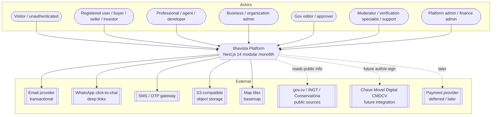
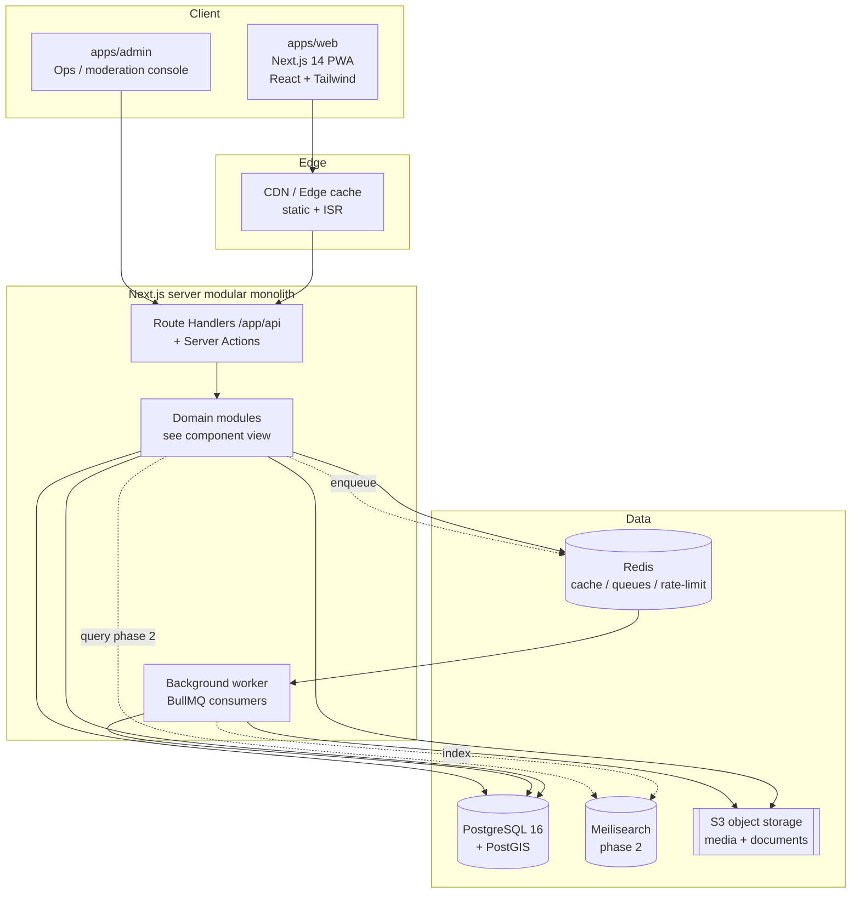
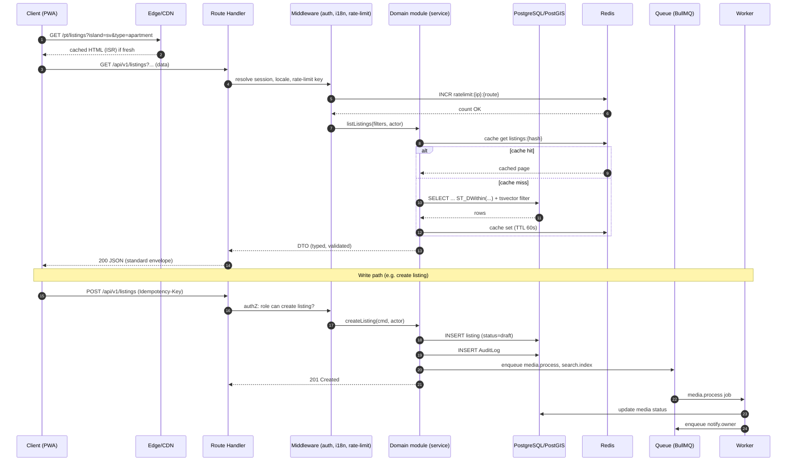
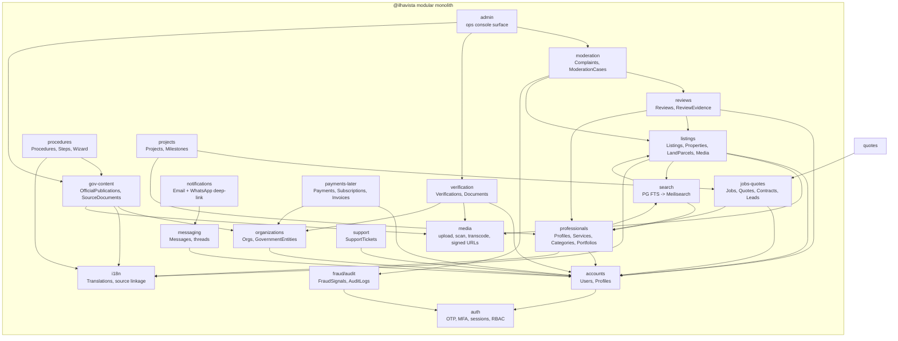
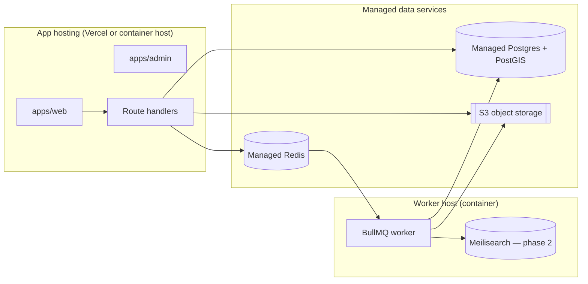
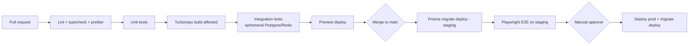
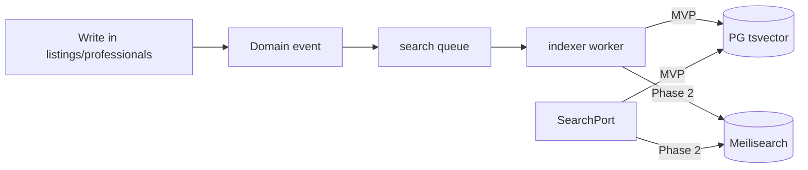
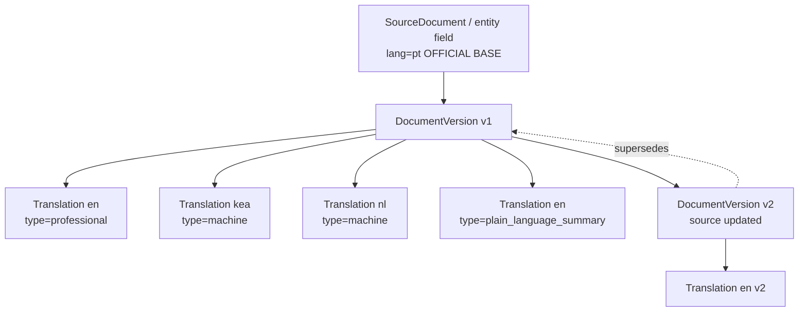

# Ilhavista — Technical Architecture

> **Status:** Architecture document, v0.1 · **Date:** 2026-07-20
> **Classification legend:** **FACT** (confirmed source) · **ASSUMPTION** (single/indirect source) · **HYPOTHESIS** (reasoned guess) · **RECOMMENDATION** (our advice)
> This document describes the target architecture for the **MVP (modular monolith)** and the extraction path beyond it. It must remain consistent with the [Project Canon](_canon.md). Anything marked *To validate* is not yet confirmed.

---

## 0. Scope and principles

**RECOMMENDATION — architecture principles (in priority order):**

1. **Ship the pilot fast.** One deployable unit, end-to-end TypeScript, minimum moving parts. (Canon: *Keep MVP simple — no microservices unless proven necessary.*)
2. **Modular, not micro.** Strong internal module boundaries so services can be extracted later without a rewrite.
3. **Trust-first and auditable.** Verification, moderation and official information are first-class; every state change that affects trust is logged (see `AuditLogs`).
4. **Privacy-by-design.** Personal and sensitive data are classified, access-controlled (RBAC) and minimised. (Canon fact 8: CNPD / RGPD-aligned regime — *legal verification required*.)
5. **Multilingual by construction.** Source text is preserved; translations are linked artifacts, never destructive overwrites. (Canon: pt/kea/en/nl/fr.)
6. **Mobile-first, low-bandwidth.** Audience is mobile-dominant. (Canon fact 1 — **FACT/high**: 73.5% internet, 115% mobile connections.)

---

## 1. System context (C4 Level 1)



**Notes**
- **CMDCV** (Chave Móvel Digital, via Autentika) and **NOSi** e-gov backbone are **FACT/high-med** (canon fact 2). Integration is a **later-phase HYPOTHESIS**, *government confirmation required*; MVP does **not** depend on it.
- **Payments** are deferred per MVP scope (**WON'T yet**: full escrow/payments). The module exists as a boundary only (see §5 *payments-later*).
- **gov.cv** public sources are read/curated by editors for `gov-content`; there is no guaranteed API. **ASSUMPTION**, *government confirmation required*.

---

## 2. Container view (C4 Level 2)



**Container responsibilities**

| Container | Tech | Responsibility |
|---|---|---|
| `apps/web` | Next.js 14 App Router, React, TS strict, Tailwind, PWA | Public multilingual PWA; SSR/ISR for SEO on listings, professionals, gov-content; client interactivity for search/map/messaging. |
| `apps/admin` | Next.js (same monorepo) | Ops console: moderation queue, verification workflow, gov-content editorial, support, finance views. Separate app, shared packages, stricter RBAC. |
| Route Handlers + Server Actions | Next.js `/app/api/*`, server actions | The API surface and command layer. Thin transport; delegates to domain modules. |
| Background worker | Node process, BullMQ on Redis | Async jobs: media processing, malware scan, notifications, search indexing, translation jobs, verification re-check reminders. |
| PostgreSQL + PostGIS | Postgres 16 + PostGIS, Prisma | System of record. Geo queries for listings/map. Full-text search (MVP). |
| Redis | Redis 7 | Cache, rate-limit counters, OTP throttling, BullMQ queues, idempotency keys, session assist. |
| Meilisearch | Meilisearch | **Phase 2** relevance search. Not in MVP. |
| Object storage | S3-compatible | Listing media, verification documents, source documents. Signed URLs; malware scan on upload. |

---

## 3. Request lifecycle



**Cross-cutting middleware order (RECOMMENDATION):**
`request-id → locale resolution → auth/session → RBAC guard → rate-limit → idempotency (writes) → validation (zod) → handler → error envelope → audit`.

---

## 4. Chosen stack and justification

### 4.1 Why a modular monolith on Next.js for the MVP

**FACT (canon):** stack is Next.js 14 App Router + TS strict + Tailwind + PWA; modular monolith via route handlers/server actions; PostgreSQL + PostGIS + Prisma; Redis; PG FTS → Meilisearch; S3; pnpm + Turborepo.

**RECOMMENDATION — rationale:**

| Concern | Why modular monolith wins for the pilot |
|---|---|
| **Speed to pilot** | One deploy, one codebase, one CI pipeline. The São Vicente pilot needs shipping, not distributed-systems ops. |
| **End-to-end TypeScript** | Shared `@ilhavista/types`, `@ilhavista/validation` (zod) from DB to UI eliminates a class of integration bugs. |
| **Team size** | A small team cannot operate N services, N pipelines, N on-call surfaces. |
| **Transaction integrity** | Trust/verification/moderation flows need multi-entity consistency — trivial in one Postgres, painful across services. |
| **SEO + i18n** | Next.js SSR/ISR gives multilingual, indexable listing and gov-content pages out of the box. |
| **Cost** | Single Postgres + Redis + object storage + one app host. Minimal fixed cost during validation. |

### 4.2 Module boundaries as the seam for future extraction

Even as a monolith, modules communicate through **explicit service interfaces** (not by reaching into each other's Prisma models). This is the discipline that makes later extraction cheap.

```
apps/web, apps/admin
  └── call → module public API (e.g. @ilhavista/modules/listings)
                └── module internals: service, repository, dto, events
                      └── @ilhavista/database (Prisma) — module owns its tables
```

**RECOMMENDATION — extract a module into a NestJS service only when a concrete trigger fires:**

| Trigger (any one) | Candidate first extractions |
|---|---|
| A module's write throughput or CPU dominates and needs independent scaling | `search` (indexing), `media` (image/video processing), `notifications` |
| A module needs an independent deploy cadence / different team ownership | `payments`, `verification` |
| Compliance isolation demanded (e.g. payments/PII segregation) | `payments`, `messaging` |
| Third-party SLA / async integration (e.g. CMDCV, PSP) with heavy retries | `verification`, `payments` |

**HYPOTHESIS:** `media` and `search` are the most likely first extractions because they are CPU/IO heavy and already asynchronous behind the queue — extracting them changes almost nothing for callers.

### 4.3 Technology decisions summary

| Layer | Choice | Justification | Reversibility |
|---|---|---|---|
| Runtime | Node.js (Next.js server) | End-to-end TS, huge ecosystem | Worker is plain Node — portable to NestJS |
| ORM | Prisma | Type-safe, migrations, single schema in `packages/database` | Repository pattern isolates it |
| DB | PostgreSQL 16 + PostGIS | Geo (canon) + FTS + strong consistency + JSONB | Standard SQL |
| Cache/queue | Redis + BullMQ | One dependency for cache, rate-limit, queues | Queue behind an interface |
| Search | PG FTS (MVP) → Meilisearch | Avoid premature infra; upgrade when relevance/scale demands | Search behind `SearchPort` interface |
| Storage | S3-compatible | Signed URLs, malware scan, cheap | S3 API is a standard |
| Validation | zod (`@ilhavista/validation`) | Shared client+server contracts | — |

---

## 5. Domain modules (C4 Level 3 — component view)

Each module owns its tables, exposes a typed service API, emits domain events, and declares its cross-module dependencies. Modules **never** import another module's repository directly — only its public service or subscribe to its events.



### 5.1 Module responsibilities and boundaries

| Module | Owns (primary tables) | Responsibility | Key dependencies |
|---|---|---|---|
| **auth** | Roles, Permissions, sessions, OTP/MFA state | Email+phone OTP, MFA, session mgmt, device monitoring, RBAC policy | — |
| **accounts** | Users, Profiles, Favorites | Identity profiles, preferences, favourites | auth |
| **organizations** | Organizations, GovernmentEntities | Org profiles, membership, gov entity records | accounts |
| **listings** | Properties, LandParcels, Listings, ListingMedia, Locations, Islands, Municipalities | Property/land inventory, geo, lifecycle (draft→published→archived) | media, search, i18n |
| **professionals** | Professionals, Services, Categories, Portfolios | Professional/agent/developer profiles, service catalogue | accounts, search, i18n |
| **reviews** | Reviews, ReviewEvidence | Verified reviews tied to real interactions | listings, professionals |
| **verification** | Verifications, VerificationDocuments | L0–L5 verification workflow, badges, re-check | media, orgs |
| **gov-content** | OfficialPublications, SourceDocuments, DocumentVersions | Neutral, source-linked public information | i18n, media |
| **procedures** | Procedures, ProcedureSteps | Procedure wizard v1 (buying/building/registering) | gov-content, i18n |
| **jobs-quotes** | Jobs, Quotes, Contracts, Leads | Job posting, quoting, lead capture | professionals |
| **projects** | Projects, ProjectMilestones | Optional project dashboard (SHOULD/COULD) | jobs, professionals |
| **messaging** | Messages | In-platform threads; WhatsApp deep-link handoff | accounts |
| **notifications** | Notifications | Email + WhatsApp click-to-chat notifications | messaging |
| **moderation** | Complaints, ModerationCases | Human-in-the-loop moderation | reviews, listings, fraud |
| **payments-later** | Payments, Subscriptions, Invoices | Boundary only in MVP; billing when enabled | accounts, orgs |
| **search** | (index only) | PG FTS + PostGIS now; Meilisearch later | listings, professionals |
| **media** | (ListingMedia assist, blobs) | Upload, malware scan, transcode, signed URLs | S3 |
| **i18n** | Translations | Source-text preservation + linked translations | — |
| **fraud/audit** | FraudSignals, AuditLogs | Signals, tamper-evident audit trail | auth |
| **support** | SupportTickets | Concierge/support desk | accounts |
| **admin** | (cross-cutting surface) | Ops console composition | moderation, verification, gov-content |

**RECOMMENDATION:** cross-module reads that are hot (e.g. a listing card needs the owner's verification badge) go through a **read model / denormalised projection** updated on events, not through synchronous cross-module joins. Keeps boundaries clean and enables later extraction.

---

## 6. Deployment model

### 6.1 Environments

**FACT (canon):** environments are **development / test / staging / production**.

| Env | Purpose | Data | Notes |
|---|---|---|---|
| development | Local + shared dev | Synthetic/seed | Docker Compose: Postgres+PostGIS, Redis, MinIO (S3), Mailpit |
| test | CI ephemeral | Fixtures | Spun per pipeline run; migrations applied fresh |
| staging | Pre-prod mirror | Anonymised subset | Same infra shape as prod; used for release validation, DR drills |
| production | Live pilot | Real | São Vicente pilot first |

### 6.2 Topology (RECOMMENDATION)



**Deployment options (RECOMMENDATION):**
- **Option A — Vercel for `apps/web`/`apps/admin`** (fast, great DX, ISR/edge) **+ a container host for the long-running BullMQ worker and Meilisearch** (Vercel functions are not suited to always-on queue consumers). *To validate: data residency / latency to Cabo Verde.*
- **Option B — fully containerised** (Docker) on a single provider (app + worker + managed Postgres/Redis/S3). Simpler mental model, portable, avoids serverless cold-starts for OTP-heavy flows.

**HYPOTHESIS:** Option B (containers) may serve the pilot better because OTP auth and messaging benefit from warm connections and predictable latency, and worker + app share one operational model. Revisit with real latency data.

### 6.3 CI/CD



- **Turborepo** caches build/test per package; only affected packages rebuild. (Canon: pnpm + Turborepo.)
- **Migrations:** `prisma migrate deploy` runs as a gated step; migrations are **forward-only and backwards-compatible** (expand/contract) so app and DB can roll independently.
- **Secrets** per environment in the host's secret manager; never in the repo.

### 6.4 Background jobs / queues

BullMQ on Redis. Queues (RECOMMENDATION):

| Queue | Jobs | Retry policy |
|---|---|---|
| `media` | scan, transcode, thumbnail, EXIF strip | 5 attempts, exp backoff |
| `search` | index/reindex listing & professional | 3 attempts |
| `notifications` | email send, WhatsApp deep-link build, digest | 5 attempts, DLQ |
| `i18n` | machine-translation job, translation status | 3 attempts |
| `verification` | re-check reminders, expiry, evidence checks | 3 attempts |
| `maintenance` | soft-delete purge, audit compaction, backups verify | scheduled |

Dead-letter queue + alert on repeated failure. Idempotent job handlers keyed by entity id + revision.

---

## 7. Observability, backups, DR, incident management

### 7.1 Monitoring / logging / observability (RECOMMENDATION)

- **Structured JSON logs** with `request_id`, `actor_id`, `module`, `route`, `latency_ms`. No PII in logs (emails/phones redacted/hashed).
- **Metrics:** RED (Rate, Errors, Duration) per route + queue depth, job failure rate, DB pool saturation, cache hit ratio, OTP send/verify rates (fraud signal).
- **Tracing:** OpenTelemetry spans across handler → module → DB/queue. *To validate: chosen backend (e.g. self-host vs SaaS).*
- **Error tracking:** Sentry-style capture with source maps for `apps/web`.
- **Uptime / synthetic checks** on critical flows: login OTP, listing search, gov-content page.
- **Product analytics** via `@ilhavista/analytics` (privacy-respecting; consent-aware given CNPD regime).

### 7.2 Backups

| Asset | Strategy |
|---|---|
| PostgreSQL | Automated daily full + PITR (WAL) with ≥7-day retention (pilot); longer for prod. Encrypted at rest. |
| Object storage | Versioning enabled; lifecycle rules; cross-region copy for critical buckets (verification/source docs). |
| Redis | Treated as ephemeral (cache/queue). Durable data is never Redis-only. AOF for in-flight jobs. |
| Secrets/config | Backed up in secret manager; documented in `/infrastructure`. |

**Backups are verified by periodic restore drills into staging** (not assumed to work).

### 7.3 Disaster recovery (RECOMMENDATION targets — *to validate with ops budget*)

| Metric | Pilot target | Rationale |
|---|---|---|
| **RPO** (max data loss) | ≤ 15 min | PITR/WAL shipping |
| **RTO** (max downtime) | ≤ 4 h | Managed Postgres restore + redeploy |

DR runbook lives in `/infrastructure`; rehearsed at least once before public launch and after major schema changes.

### 7.4 Incident management (RECOMMENDATION)

- **Severity ladder** SEV1–SEV4 (SEV1 = data loss / breach / total outage).
- **On-call** rotation (small team; documented escalation).
- **Breach path:** any suspected personal-data breach triggers the CNPD notification assessment (**legal verification required** — canon fact 8) and the `fraud/audit` trail is preserved.
- **Post-incident review** with blameless write-up stored in `/docs/incidents`.

---

## 8. Search strategy

**FACT (canon):** PostgreSQL full-text + PostGIS for MVP → Meilisearch when catalogue/relevance needs grow.

### 8.1 MVP — Postgres FTS + PostGIS

- Each searchable entity carries a `tsvector` column (generated/maintained) over title, description, locality, category — **built from the source language plus available translations** so a Dutch query can match a Portuguese listing via its linked translation.
- Geo filters via PostGIS: `ST_DWithin`, bounding-box for map viewport, `ST_Distance` for "near me".
- Faceting (island, municipality, type, price band, verification level) via indexed columns.

```sql
-- Illustrative (RECOMMENDATION)
SELECT l.id, l.title, ST_Distance(loc.geom, :point) AS dist
FROM "Listing" l
JOIN "Location" loc ON loc.id = l."locationId"
WHERE l.status = 'published'
  AND l."deletedAt" IS NULL
  AND l.search_vector @@ websearch_to_tsquery('simple', :q)
  AND ST_DWithin(loc.geom, :point, :radius_m)
  AND (:island IS NULL OR loc."islandId" = :island)
ORDER BY dist ASC
LIMIT 20 OFFSET :offset;
```

### 8.2 Phase 2 — Meilisearch

- Introduced when relevance/typo-tolerance/multilingual ranking outgrow PG FTS.
- **Search behind a `SearchPort` interface** so swapping the implementation does not touch callers.
- Worker consumes domain events (`listing.published`, `professional.updated`) and keeps the index current. Postgres remains the system of record; the index is a derived, rebuildable projection.



---

## 9. Caching strategy (RECOMMENDATION)

| Layer | What | Mechanism | Invalidation |
|---|---|---|---|
| Edge/CDN | Public listing, professional, gov-content pages | Next.js ISR + `revalidateTag` | Tag-based on publish/update events |
| App/Redis | Hot query results (search pages, facets), read models | Redis with short TTL (30–120s) + explicit bust | Event-driven bust on entity change |
| DB | Materialised read models / denormalised projections | Postgres tables updated by worker | Rebuilt from events |
| Client | PWA static shell, offline fallback | Service worker (Workbox) | Versioned SW |

Principles: **cache public, never cache personal/sensitive behind auth without `Cache-Control: private`**; keys include locale; write paths emit invalidation events rather than guessing TTLs.

---

## 10. i18n architecture

**FACT (canon):** languages pt (official base), kea, en, nl, fr. Official source texts always preserved; translations linked to source. Distinguish **professional vs machine vs official government text vs plain-language summary**.

### 10.1 Model

- **Source text is immutable per version.** A translatable field is not stored inline as a mutable string; it references a `Translation` set linked to a source with a `translationType`.
- `translationType ∈ { official, professional, machine, plain_language_summary }` with a **quality/trust ordering**: `official > professional > machine`; a `plain_language_summary` is a distinct, clearly-labelled derivative, never presented as the official text.
- **UI selects best available translation** for the requested locale, and **always shows provenance** (e.g. "Machine translation — may contain errors", "Official text (pt)").



### 10.2 Rules

- Updating a source creates a **new version**; existing translations are marked **stale** until re-translated (never silently shown as current).
- **Official government text** (canon: gov.cv, INGT, Conservatória, etc.) is stored verbatim with its source citation; machine/plain-language variants are additive and labelled. *Government confirmation required* before presenting anything as official.
- UI/URL locale via Next.js App Router segments (`/pt`, `/kea`, `/en`, `/nl`, `/fr`); `@ilhavista/i18n` holds message catalogues for chrome, while **content** translations live in the DB (`Translations`).

---

## 11. Notifications (email + WhatsApp)

**FACT (canon MVP):** email + **WhatsApp-oriented** notifications; WhatsApp support is concierge. **ASSUMPTION/high** — WhatsApp is dominant given mobile-first market (canon fact 1).

### 11.1 MVP approach — email + WhatsApp click-to-chat deep links

- **Email:** transactional (OTP, lead received, verification status, moderation outcome, digests) via a transactional provider. Templates are localised.
- **WhatsApp for MVP = click-to-chat deep links, not the Business API.** The platform generates `https://wa.me/<phone>?text=<prefilled>` (or `whatsapp://`) links so a user can start a conversation from a listing/professional/lead. This needs **no WhatsApp Business API approval** and fits the concierge model.

```mermaid
sequenceDiagram
    participant Buyer
    participant Ilhavista
    participant Seller as Seller (WhatsApp)
    Buyer->>Ilhavista: Click "Contact via WhatsApp" on listing
    Ilhavista->>Ilhavista: Build wa.me deep link with prefilled, tracked context
    Ilhavista-->>Buyer: Open WhatsApp (deep link) + log Lead
    Buyer->>Seller: Prefilled message (listing ref)
    Note over Ilhavista: Lead recorded; conversation happens off-platform (MVP)
```

- Every WhatsApp handoff **creates a `Lead`** so the interaction is measured even though the chat happens off-platform.
- **Later (HYPOTHESIS):** upgrade to WhatsApp Business API for templated, two-way, on-platform notifications once volume and approval justify it. *To validate.*

### 11.2 Delivery architecture

- Notifications are **enqueued** (`notifications` queue), rendered per locale, and sent by the worker with retry + DLQ.
- User **notification preferences** (channel opt-in, digest cadence) respected; consent tracked (CNPD regime — *legal verification required*).
- In-app notifications persisted in `Notifications`; email/WhatsApp are delivery channels layered on top.

---

## 12. Security posture (summary)

- **Auth:** email + phone OTP, MFA, session management, device monitoring (canon). OTP rate-limited and throttled in Redis; codes hashed, short TTL.
- **RBAC:** roles/permissions enforced at the module service boundary, not only in UI. Canon role set (visitor … superadmin).
- **Storage:** signed URLs, malware scan on upload, EXIF stripping; verification/source documents in access-restricted buckets.
- **Transport:** HTTPS only; strict CSP for `apps/admin`.
- **Data protection:** privacy classification per table (see [data model](./11-data-model.md)); minimisation; audit trail. CNPD/RGPD-aligned obligations *legal verification required* (canon fact 8).
- **Auditability:** `AuditLogs` for every trust-affecting mutation; `FraudSignals` feed moderation.

---

## 13. Open items / to validate

| # | Item | Label |
|---|---|---|
| 1 | Hosting choice (Vercel + worker host vs fully containerised) and data residency/latency to Cabo Verde | RECOMMENDATION — *to validate* |
| 2 | CMDCV / NOSi integration feasibility and terms | HYPOTHESIS — *government confirmation required* |
| 3 | gov.cv / INGT public-source access (curated vs API) | ASSUMPTION — *government confirmation required* |
| 4 | CNPD data-protection obligations (breach notice, DPIA, retention) | ASSUMPTION — *legal verification required* |
| 5 | Observability/error-tracking vendor and cost | RECOMMENDATION — *to validate* |
| 6 | WhatsApp Business API upgrade timing | HYPOTHESIS — *to validate* |
| 7 | DR RPO/RTO targets vs ops budget | RECOMMENDATION — *to validate* |

---

*Companion documents:* [Data model](./11-data-model.md) · [API design](./12-api-design.md). This is an engineering artifact, not legal advice; all *verification required* items must be confirmed before public claims or commitments.
