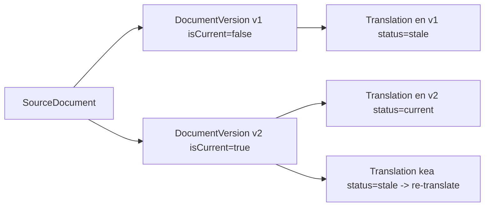

# Djarvista — Data Model

> **Status:** Data model document, v0.1 · **Date:** 2026-07-20
> **Classification legend:** **FACT** (confirmed source) · **ASSUMPTION** (single/indirect source) · **HYPOTHESIS** (reasoned guess) · **RECOMMENDATION** (our advice)
> This schema is implemented via **Prisma** in `packages/database`. Entity names are **PascalCase** and consistent across code and docs. Attributes below are the RECOMMENDED starting schema for the MVP; they will evolve through migrations. Must remain consistent with the [Project Canon](_canon.md) and the [Technical Architecture](./10-technical-architecture.md).

---

## 0. Conventions

- **PKs:** every table has `id` — a CUID/UUID string (`@id @default(cuid())`), unless noted.
- **FKs:** `<entity>Id` naming (e.g. `ownerId`, `listingId`).
- **Audit fields (all tables):** `createdAt`, `createdById?`, `updatedAt`, `updatedById?`.
- **Soft delete (most tables):** `deletedAt?`, `deletedById?` (see §4.1). Hard-delete only where legally required.
- **Enums** are Prisma enums (PascalCase values in code; shown lowercased here for readability).
- **Geo** columns use PostGIS `geography(Point,4326)` via Prisma `Unsupported` / raw where needed.
- **Money** stored as integer **minor units in CVE** (`amountCents`, currency default `CVE`), plus optional `amountEurCents` snapshot at the pegged rate **110.265 CVE = 1 EUR** (canon — **FACT/high, still verify**).
- **i18n:** translatable long-form content is linked via `Translations`, not stored as mutable inline strings (see architecture §10).

---

## 1. Entity-Relationship diagram (Mermaid)

```mermaid
erDiagram
    User ||--o| Profile : has
    User ||--o{ UserRole : assigned
    Role ||--o{ UserRole : grants
    Role ||--o{ RolePermission : has
    Permission ||--o{ RolePermission : in
    User ||--o{ OrganizationMember : member
    Organization ||--o{ OrganizationMember : has
    Organization ||--o| GovernmentEntity : is
    User ||--o{ Favorite : saves
    User ||--o{ AuditLog : acts
    User ||--o{ SupportTicket : opens
    User ||--o{ Notification : receives

    Organization ||--o{ Professional : employs
    User ||--o| Professional : is
    Professional ||--o{ ProfessionalService : offers
    Service ||--o{ ProfessionalService : offered_as
    Category ||--o{ Service : classifies
    Category ||--o{ Category : parent
    Professional ||--o{ Portfolio : showcases

    Property ||--o{ Listing : listed_as
    LandParcel ||--o{ Listing : listed_as
    Property }o--o| LandParcel : on
    Listing ||--o{ ListingMedia : has
    Listing }o--|| Location : at
    Property }o--|| Location : at
    LandParcel }o--|| Location : at
    Island ||--o{ Municipality : contains
    Municipality ||--o{ Location : contains
    User ||--o{ Listing : owns
    Organization ||--o{ Listing : owns

    Listing ||--o{ Favorite : favorited
    Listing ||--o{ Lead : generates
    Professional ||--o{ Lead : receives
    Listing ||--o{ Review : reviewed
    Professional ||--o{ Review : reviewed
    Review ||--o{ ReviewEvidence : supports

    User ||--o{ Verification : requests
    Organization ||--o{ Verification : requests
    Professional ||--o{ Verification : requests
    Listing ||--o{ Verification : requests
    Verification ||--o{ VerificationDocument : includes

    GovernmentEntity ||--o{ OfficialPublication : issues
    OfficialPublication }o--|| SourceDocument : from
    SourceDocument ||--o{ DocumentVersion : versioned
    DocumentVersion ||--o{ Translation : translated
    OfficialPublication ||--o{ Translation : translated
    Procedure ||--o{ ProcedureStep : has
    Procedure }o--o{ OfficialPublication : references
    Procedure ||--o{ Translation : translated

    Job ||--o{ Quote : receives
    User ||--o{ Job : posts
    Professional ||--o{ Quote : submits
    Quote ||--o| Contract : becomes
    Contract ||--o| Project : delivers
    Project ||--o{ ProjectMilestone : has
    Job }o--o| Listing : about

    User ||--o{ Message : sends
    Message }o--o| Lead : within
    Message }o--o| Job : within

    Complaint }o--|| User : filed_by
    Complaint ||--o| ModerationCase : escalates
    ModerationCase }o--o| Listing : about
    ModerationCase }o--o| Review : about
    ModerationCase }o--o| Professional : about
    FraudSignal }o--o| User : about
    FraudSignal }o--o| Listing : about

    User ||--o{ Subscription : holds
    Organization ||--o{ Subscription : holds
    Subscription ||--o{ Invoice : bills
    Invoice ||--o{ Payment : paid_by
    Listing ||--o{ Payment : promotes
    Verification ||--o{ Payment : fees
```

> Note: Mermaid ER edges are simplified (some polymorphic links — e.g. `Verification` targeting User/Org/Professional/Listing — are modelled with nullable typed FKs + a `subjectType` discriminator in the tables below).

---

## 2. Table-by-table overview

Privacy classification: **public** (safe to expose) · **internal** (ops-only, non-personal) · **personal** (identifies a person) · **sensitive** (special-category / documents / financial).

### 2.1 Identity & access

#### User — *personal*
| Column | Type | Notes |
|---|---|---|
| id (PK) | string | cuid |
| email | citext unique | nullable if phone-only |
| phone | string unique | E.164; primary OTP channel |
| emailVerifiedAt / phoneVerifiedAt | timestamptz? | |
| passwordHash | string? | optional; OTP-first |
| mfaEnabled | bool | |
| mfaSecret | string? | encrypted at rest — *sensitive* |
| status | enum | active / suspended / pending |
| lastLoginAt | timestamptz? | |
| locale | enum | pt/kea/en/nl/fr |
| + audit + soft-delete | | |

**Indexes:** unique(email), unique(phone), index(status). **Constraints:** at least one of email/phone NOT NULL (check).

#### Profile — *personal*
| Column | Type | Notes |
|---|---|---|
| id (PK) | string | |
| userId (FK→User) unique | string | 1:1 |
| displayName | string | |
| avatarMediaId | string? | |
| bio | text? | translatable via Translations |
| preferredLanguage | enum | |
| notificationPrefs | jsonb | channel opt-ins |
| + audit + soft-delete | | |

#### Role — *internal*
`id, key (unique, e.g. "moderator"), name, description, isSystem bool`. Seeded from canon role set (visitor…superadmin).

#### Permission — *internal*
`id, key (unique, e.g. "listing:publish"), description`.

#### UserRole (join) — *internal*
`id, userId FK, roleId FK, scopeType?, scopeId?` (scope enables org- or island-scoped roles). **Unique(userId, roleId, scopeId).**

#### RolePermission (join) — *internal*
`id, roleId FK, permissionId FK`. **Unique(roleId, permissionId).**

### 2.2 Organizations & government

#### Organization — *personal/internal*
| Column | Type | Notes |
|---|---|---|
| id (PK) | string | |
| name | string | |
| slug | string unique | |
| type | enum | agency / developer / supplier / firm / gov |
| taxId (NIF) | string? | *sensitive* |
| registrationNo | string? | EASE/commercial registry (canon fact 6) |
| verificationLevel | enum(L0–L5) | denormalised from latest Verification |
| primaryLocationId | FK? | |
| + audit + soft-delete | | |

**Indexes:** unique(slug), index(type), index(verificationLevel).

#### GovernmentEntity — *public*
`id, organizationId FK? (1:1 optional), name, level enum(national/municipal/institutional), islandId?, municipalityId?, officialUrl, contactInfo jsonb`. Represents gov.cv / INGT / Conservatória / Casa do Cidadão etc. (canon facts 2,3,6) — *government confirmation required* before presenting as partner.

#### OrganizationMember (join) — *internal*
`id, organizationId FK, userId FK, role enum(admin/agent/editor/member), invitedAt, acceptedAt?`. **Unique(organizationId, userId).**

### 2.3 Property & listings

#### Island — *public*
`id, code (unique, e.g. "SV"), namePt, geom (polygon)`. Seeded: 9 inhabited islands (canon fact 7 — **ASSUMPTION/med**).

#### Municipality — *public*
`id, islandId FK, code unique, namePt, geom (polygon)`.

#### Location — *public*
`id, islandId FK, municipalityId FK, locality string, address string?, geom geography(Point,4326), precision enum(exact/approx/island_only)`. **Indexes:** GiST(geom), index(municipalityId).

#### Property — *personal (owner link) / public (attributes)*
| Column | Type | Notes |
|---|---|---|
| id (PK) | string | |
| ownerUserId FK? / ownerOrgId FK? | string | one required |
| locationId FK | string | |
| landParcelId FK? | string | building on a parcel |
| type | enum | apartment/house/commercial/land/tourism |
| bedrooms / bathrooms | int? | |
| areaSqm | numeric? | |
| yearBuilt | int? | |
| titleStatus | enum | registered/unregistered/in_process — *sensitive*, Conservatória (canon fact 3) |
| + audit + soft-delete | | |

#### LandParcel — *personal/public*
`id, ownerUserId?/ownerOrgId?, locationId FK, parcelRef string? (INGT/LMITS ref — canon fact 3), areaSqm numeric, landUse enum(residential/tourism/commercial/agricultural), geom geography(Polygon,4326)?, registrationStatus enum`. **Note:** agricultural land conditional for foreigners (canon fact 3 — *legal verification required*).

#### Listing — *public*
| Column | Type | Notes |
|---|---|---|
| id (PK) | string | |
| propertyId FK? / landParcelId FK? | string | one required |
| ownerUserId FK? / ownerOrgId FK? | string | one required |
| locationId FK | string | denormalised for search |
| title | string | translatable |
| descriptionSourceId | FK→SourceDocument? | translatable body |
| transactionType | enum | sale / rent |
| priceCents | bigint | CVE minor units |
| priceEurCents | bigint? | snapshot at peg |
| status | enum | draft/pending/published/archived/rejected |
| tier | enum | basic/premium/featured (canon business model) |
| isSponsored | bool | always labelled if featured/premium promoted |
| featuredUntil | timestamptz? | |
| verificationLevel | enum(L0–L5) | denormalised |
| searchVector | tsvector | generated (FTS, arch §8) |
| publishedAt | timestamptz? | |
| + audit + soft-delete | | |

**Indexes:** index(status, transactionType), index(locationId), index(tier), GIN(searchVector), index(publishedAt). **Constraint:** exactly one of propertyId/landParcelId; `isSponsored` must be true when tier ∈ {premium, featured} at promotion time.

#### ListingMedia — *public*
`id, listingId FK, kind enum(image/video/document/floorplan), storageKey, url signed-on-read, contentType, sizeBytes, width?, height?, order int, scanStatus enum(pending/clean/infected), altText (translatable)`. **Index:** index(listingId, order). Malware scan required before `published`.

#### Favorite (join) — *personal*
`id, userId FK, listingId FK, createdAt`. **Unique(userId, listingId).**

### 2.4 Professionals & services

#### Professional — *personal/public*
| Column | Type | Notes |
|---|---|---|
| id (PK) | string | |
| userId FK? / organizationId FK? | string | individual or org-bound |
| headline | string | translatable |
| bioSourceId FK? | SourceDocument | translatable |
| professionType | enum | agent/architect/contractor/tradesperson/developer/lawyer/notary/supplier |
| verificationLevel | enum(L0–L5) | denormalised |
| ratingAvg | numeric(2,1) | denormalised from Reviews |
| ratingCount | int | |
| primaryLocationId FK? | | |
| searchVector | tsvector | |
| + audit + soft-delete | | |

**Indexes:** index(professionType), index(verificationLevel), GIN(searchVector), index(ratingAvg).

#### Category — *public*
`id, parentId FK? (self), key unique, namePt (translatable), kind enum(service/material/property)`. Tree.

#### Service — *public*
`id, categoryId FK, key, namePt (translatable), description (translatable)`.

#### ProfessionalService (join) — *public*
`id, professionalId FK, serviceId FK, priceFromCents?, priceUnit enum(hour/project/sqm/visit)?`. **Unique(professionalId, serviceId).**

#### Portfolio — *public*
`id, professionalId FK, title (translatable), description (translatable), mediaIds string[], projectId FK?, completedAt?, order int`.

### 2.5 Reviews & verification

#### Review — *personal/public*
| Column | Type | Notes |
|---|---|---|
| id (PK) | string | |
| authorUserId FK | string | |
| subjectType | enum | listing/professional/organization |
| subjectListingId FK? / subjectProfessionalId FK? | | |
| rating | int (1–5) | check 1..5 |
| body | text | translatable; moderated |
| status | enum | pending/published/rejected/hidden |
| isVerifiedInteraction | bool | tied to a real Lead/Job/Contract |
| + audit + soft-delete | | |

**Indexes:** index(subjectProfessionalId), index(subjectListingId), index(status). **Constraint:** one published review per (author, subject) — **Unique(authorUserId, subjectProfessionalId)** partial where status='published'. Canon guardrail: paid visibility never buys review scores.

#### ReviewEvidence — *sensitive*
`id, reviewId FK, kind enum(receipt/contract/message_ref/photo), storageKey?, referenceId?, verifiedByUserId?`. Backs `isVerifiedInteraction`.

#### Verification — *sensitive*
| Column | Type | Notes |
|---|---|---|
| id (PK) | string | |
| subjectType | enum | user/organization/professional/listing/property |
| subjectUserId FK? / subjectOrgId FK? / subjectProfessionalId FK? / subjectListingId FK? | | polymorphic via typed nullable FKs |
| level | enum | L0–L5 (canon verification levels) |
| status | enum | requested/in_review/approved/rejected/expired |
| reviewedByUserId FK? | | verification specialist |
| decidedAt | timestamptz? | |
| validUntil | timestamptz? | re-check window per level |
| feeCents | bigint? | verification fee per level |
| notes | text? | internal |
| + audit + soft-delete | | |

**Indexes:** index(subjectType, status), index(level), index(validUntil). Drives denormalised `verificationLevel` on subjects.

#### VerificationDocument — *sensitive*
`id, verificationId FK, docType enum(id/business_reg/permit/certificate/title_deed/other), storageKey (restricted bucket), scanStatus, expiresAt?, uploadedByUserId FK`. Access strictly RBAC-limited; signed URLs short-lived.

### 2.6 Government content & procedures

#### SourceDocument — *public*
`id, sourceEntityId FK→GovernmentEntity?, sourceUrl, sourceTitle, originalLanguage enum (default pt), retrievedAt, checksum, currentVersionId FK?`. Canonical original text preserved verbatim (canon: source always preserved).

#### DocumentVersion — *public*
`id, sourceDocumentId FK, versionNo int, body text (verbatim), effectiveFrom?, effectiveTo?, supersedesId FK?, isCurrent bool`. **Unique(sourceDocumentId, versionNo).** Versioning is append-only (see §4.2).

#### OfficialPublication — *public*
`id, governmentEntityId FK, sourceDocumentId FK, title (translatable), category enum(law/tax/procedure/notice/form), status enum(draft/published/archived), publishedAt, isOfficial bool`. *Government confirmation required* before `isOfficial=true`.

#### Translation — *public*
| Column | Type | Notes |
|---|---|---|
| id (PK) | string | |
| targetType | enum | source_document/official_publication/listing/professional/procedure/service/category/profile |
| targetId | string | polymorphic |
| sourceVersionId FK? | DocumentVersion | ties translation to a source version |
| language | enum | pt/kea/en/nl/fr |
| translationType | enum | official/professional/machine/plain_language_summary (arch §10) |
| body | text | |
| status | enum | current/stale/draft |
| translatedByUserId FK? | | null for machine |
| + audit | | |

**Indexes:** index(targetType, targetId, language), index(status). **Rule:** never mutate source; new source version marks translations `stale`.

#### Procedure — *public*
`id, key unique, title (translatable), summarySourceId FK?, audience enum(buyer/builder/investor/citizen), islandScope enum(all/specific), status`. Procedure wizard v1 (canon MVP MUST).

#### ProcedureStep — *public*
`id, procedureId FK, order int, title (translatable), body (translatable), requiredDocs jsonb, relatedPublicationIds string[], estimatedDurationDays int?`. **Unique(procedureId, order).**

### 2.7 Jobs, quotes, projects

#### Lead — *personal*
`id, listingId FK?, professionalId FK?, fromUserId FK?, contactName?, contactPhone?, contactEmail?, channel enum(form/whatsapp/call), message text?, status enum(new/contacted/qualified/closed), createdAt`. WhatsApp deep-link handoffs create a Lead (arch §11). **Index:** index(professionalId, status), index(listingId).

#### Job — *personal/public*
`id, posterUserId FK, title (translatable), description (translatable), categoryId FK?, listingId FK?, budgetCents?, locationId FK?, status enum(open/quoting/awarded/closed/cancelled), deadline?`. **Index:** index(status), index(categoryId).

#### Quote — *personal*
`id, jobId FK, professionalId FK, amountCents, currency (CVE), breakdown jsonb?, message text?, validUntil?, status enum(submitted/accepted/rejected/withdrawn)`. **Unique(jobId, professionalId).** Take-rate deferred until escrow exists (canon).

#### Contract — *sensitive*
`id, quoteId FK unique, jobId FK, clientUserId FK, professionalId FK, amountCents, terms text?, status enum(draft/active/completed/disputed/cancelled), signedAt?, completedAt?`. **Note:** MVP has no escrow (canon WON'T yet).

#### Project — *personal*
`id, contractId FK?, clientUserId FK, professionalId FK?, title (translatable), status enum(planning/active/on_hold/completed), startDate?, endDate?`. COULD-scope dashboard (canon).

#### ProjectMilestone — *personal*
`id, projectId FK, order int, title (translatable), dueDate?, status enum(pending/in_progress/done), amountCents?`. **Unique(projectId, order).**

### 2.8 Messaging & notifications

#### Message — *personal*
`id, threadKey string (index), fromUserId FK, toUserId FK?, leadId FK?, jobId FK?, body text, readAt?, createdAt`. On-platform threads; WhatsApp handoff logged as Lead (arch §11). **Index:** index(threadKey, createdAt).

#### Notification — *personal*
`id, userId FK, type enum(lead/verification/moderation/message/system/digest), channel enum(in_app/email/whatsapp), payload jsonb, readAt?, sentAt?, status enum(pending/sent/failed)`. **Index:** index(userId, readAt), index(status).

### 2.9 Moderation, fraud, support, audit

#### Complaint — *personal/internal*
`id, reporterUserId FK?, subjectType enum, subjectId, reason enum(fraud/spam/inappropriate/inaccurate/other), details text?, status enum(open/triaged/resolved/dismissed)`. **Index:** index(status).

#### ModerationCase — *internal*
`id, complaintId FK?, subjectType enum, subjectId, assignedToUserId FK?, priority enum(low/med/high), decision enum(none/warn/hide/remove/ban)?, resolutionNotes text?, status enum(open/in_review/closed)`. Human-in-the-loop (canon WON'T: AI-only moderation). **Index:** index(status, priority).

#### FraudSignal — *sensitive/internal*
`id, subjectType enum, subjectId, signalType enum(otp_abuse/duplicate/velocity/blacklist/anomaly), score numeric, details jsonb, resolvedAt?`. Feeds moderation. **Index:** index(subjectType, subjectId), index(signalType).

#### SupportTicket — *personal*
`id, userId FK?, subject string, body text, channel enum(web/email/whatsapp), category enum, priority enum, status enum(open/pending/resolved/closed), assignedToUserId FK?`. Concierge support (canon). **Index:** index(status, priority).

#### AuditLog — *internal (may reference personal)*
`id, actorUserId FK?, action string (e.g. "listing.publish"), targetType, targetId, before jsonb?, after jsonb?, ip?, userAgent?, createdAt`. **Append-only** (no update/delete). **Index:** index(targetType, targetId), index(actorUserId), index(createdAt). Records every trust-affecting mutation.

### 2.10 Billing (deferred, boundary present)

#### Subscription — *personal/financial*
`id, subscriberUserId FK? / subscriberOrgId FK?, plan enum(free/pro/business), status enum(active/past_due/cancelled), priceCents (CVE), currentPeriodStart/End, cancelAtPeriodEnd bool`. Plans/prices from canon business model (Pro ≈2.500, Business ≈7.500 CVE/mo). **Index:** index(status).

#### Invoice — *financial*
`id, subscriptionId FK?, subscriberUserId?/subscriberOrgId?, number unique, amountCents, currency (CVE), taxCents?, status enum(draft/open/paid/void), issuedAt, dueAt, paidAt?`. **Index:** unique(number), index(status).

#### Payment — *financial*
`id, invoiceId FK?, listingId FK? (premium/featured), verificationId FK? (fee), amountCents, currency (CVE), method enum(deferred/manual/psp), pspReference?, idempotencyKey unique, status enum(pending/succeeded/failed/refunded), processedAt?`. **MVP:** no live PSP (canon WON'T yet); method `manual`/`deferred`. **Index:** unique(idempotencyKey), index(status).

---

## 3. Indexes & constraints — highlights

| Concern | Rule |
|---|---|
| Geo | GiST index on every `geom`; PostGIS `geography(Point,4326)` for point distance |
| Search | GIN index on `searchVector` (Listing, Professional) |
| Uniqueness | slug (Organization), email/phone (User), invoice number, join-table composite uniques |
| Referential | FKs `ON DELETE RESTRICT` for money/audit; `SET NULL` for optional links; soft-delete preferred over cascade |
| Money | integer minor units; `CHECK (amountCents >= 0)` where applicable |
| Ratings | `CHECK (rating BETWEEN 1 AND 5)` on Review |
| One-of | `CHECK` that exactly one polymorphic FK / owner FK is set |
| Idempotency | unique(idempotencyKey) on Payment and other write-sensitive tables |

---

## 4. Cross-cutting policies

### 4.1 Soft delete

- **RECOMMENDATION:** most tables carry `deletedAt`/`deletedById`; default queries filter `deletedAt IS NULL` (Prisma middleware / global `where`).
- **Hard delete** only where law requires erasure (CNPD/RGPD right-to-erasure — *legal verification required*, canon fact 8) or for truly transient data.
- **Append-only, never soft-deleted:** `AuditLog`, `DocumentVersion` (history is the point).
- Soft-deleted rows are purged after a retention window by the `maintenance` queue, subject to legal-hold checks.

### 4.2 Versioning (esp. official publications & translations)

- Source text is **immutable per version**; edits create a new `DocumentVersion`.
- Publishing a new version flips `isCurrent` and marks dependent `Translation` rows `stale` until re-done.
- Official text is preserved verbatim with citation; machine / plain-language variants are additive and labelled (canon + arch §10).

### 4.3 Audit fields

Every table: `createdAt`, `createdById?`, `updatedAt`, `updatedById?` (and soft-delete pair). Beyond row-level fields, **all trust-affecting mutations** also write an `AuditLog` entry with `before`/`after` snapshots.

### 4.4 Privacy classification (per table)

| Table | Class | Notes |
|---|---|---|
| User | personal | email/phone; mfaSecret sensitive |
| Profile | personal | |
| Role, Permission, UserRole, RolePermission | internal | |
| Organization | personal/internal | taxId/registrationNo sensitive |
| GovernmentEntity | public | |
| OrganizationMember | internal | |
| Island, Municipality, Location | public | Location precision may downgrade for privacy |
| Property, LandParcel | personal/public | titleStatus/parcelRef sensitive |
| Listing | public | owner link personal |
| ListingMedia | public | |
| Favorite | personal | |
| Professional | personal/public | |
| Category, Service, ProfessionalService, Portfolio | public | |
| Review | personal/public | body public once published |
| ReviewEvidence | sensitive | |
| Verification | sensitive | |
| VerificationDocument | sensitive | restricted bucket |
| SourceDocument, DocumentVersion, OfficialPublication | public | |
| Translation | public | |
| Procedure, ProcedureStep | public | |
| Lead | personal | contact details |
| Job | personal/public | |
| Quote | personal | |
| Contract | sensitive | financial + parties |
| Project, ProjectMilestone | personal | |
| Message | personal | |
| Notification | personal | |
| Complaint | personal/internal | |
| ModerationCase | internal | |
| FraudSignal | sensitive/internal | |
| SupportTicket | personal | |
| AuditLog | internal | may reference personal |
| Subscription, Invoice, Payment | financial (sensitive) | |

**RECOMMENDATION:** classification drives field-level access in RBAC, log redaction, export/erasure handling, and encryption-at-rest for `sensitive` columns. CNPD/RGPD obligations *legal verification required*.

---

## 5. Prisma notes

- Single schema in `packages/database/prisma/schema.prisma`; entity names **PascalCase**, matching this doc.
- PostGIS geometry via `Unsupported("geography(Point, 4326)")` columns + raw SQL for geo queries (Prisma has no native geo type).
- `searchVector` via a generated column / trigger; excluded from Prisma writes, used by raw FTS queries (arch §8).
- Enums declared in Prisma; shared to app through `@djarvista/types`.
- Migrations are forward-only, expand/contract (arch §6.3).

---

*Companion documents:* [Technical architecture](./10-technical-architecture.md) · [API design](./12-api-design.md). Attributes are the RECOMMENDED MVP starting point and will evolve via migrations. Privacy/legal items marked *verification required* must be confirmed with counsel (CNPD).
