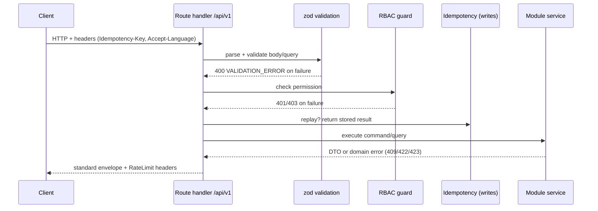

# Djarvista — API Design

> **Status:** API design document, v0.1 · **Date:** 2026-07-20
> **Classification legend:** **FACT** (confirmed source) · **ASSUMPTION** (single/indirect source) · **HYPOTHESIS** (reasoned guess) · **RECOMMENDATION** (our advice)
> The API is served by **Next.js Route Handlers** under `/app/api/v1/*` (modular monolith, canon). Contracts are shared as TypeScript + **zod** (`@djarvista/validation`). Must stay consistent with the [Project Canon](_canon.md), the [Technical Architecture](./10-technical-architecture.md), and the [Data Model](./11-data-model.md).

---

## 0. Conventions

- **Base URL:** `/api/v1`. Versioned in the path (see §7).
- **Format:** JSON, `Content-Type: application/json`. UTF-8.
- **Locale:** `Accept-Language` header or `?lang=` (pt/kea/en/nl/fr); responses echo `lang` and provenance for translated content.
- **Auth:** bearer session token / secure httpOnly cookie (see §1). RBAC enforced server-side.
- **Time:** ISO-8601 UTC. **Money:** integer minor units + `currency` (default `CVE`).
- **IDs:** opaque strings (cuid).

### 0.1 Standard success envelope

```json
{
  "data": { "id": "lst_123", "title": "Apartment in Mindelo" },
  "meta": { "requestId": "req_9f2", "lang": "en" }
}
```

Collections:

```json
{
  "data": [ { "id": "lst_123" }, { "id": "lst_124" } ],
  "meta": {
    "requestId": "req_9f2",
    "pagination": { "limit": 20, "nextCursor": "eyJpZCI6Imxz...", "hasMore": true }
  }
}
```

### 0.2 Standard error envelope

```json
{
  "error": {
    "code": "VALIDATION_ERROR",
    "message": "priceCents must be a positive integer",
    "details": [
      { "field": "priceCents", "issue": "must be >= 0" }
    ],
    "requestId": "req_9f2"
  }
}
```

**Canonical error codes**

| HTTP | code | Meaning |
|---|---|---|
| 400 | `VALIDATION_ERROR` | Body/query failed zod validation |
| 401 | `UNAUTHENTICATED` | Missing/invalid session |
| 403 | `FORBIDDEN` | Authenticated but lacks permission (RBAC) |
| 404 | `NOT_FOUND` | Resource missing or soft-deleted |
| 409 | `CONFLICT` | Uniqueness / state conflict |
| 410 | `GONE` | Version removed |
| 422 | `UNPROCESSABLE` | Semantically invalid (e.g. cannot publish unverified) |
| 423 | `LOCKED` | Under moderation |
| 429 | `RATE_LIMITED` | Too many requests (see §2) |
| 500 | `INTERNAL` | Unexpected |
| 503 | `UNAVAILABLE` | Dependency down |

---

## 1. Auth (`/auth`)

Email + phone **OTP**, MFA, sessions (canon). Passwordless-first.

| Method | Path | Purpose | Auth |
|---|---|---|---|
| POST | `/auth/otp/request` | Request OTP to email or phone | public |
| POST | `/auth/otp/verify` | Verify OTP, create session | public |
| POST | `/auth/mfa/enroll` | Begin MFA enrolment | user |
| POST | `/auth/mfa/verify` | Verify MFA challenge | user |
| POST | `/auth/session/refresh` | Refresh session | user |
| POST | `/auth/logout` | End session | user |
| GET | `/auth/sessions` | List active sessions/devices | user |
| DELETE | `/auth/sessions/{id}` | Revoke a device session | user |

**POST `/auth/otp/request`**

```json
// request
{ "channel": "phone", "identifier": "+2389xxxxxxx" }
// 202 Accepted
{ "data": { "challengeId": "chl_1", "expiresInSec": 300 }, "meta": { "requestId": "req_1" } }
```

Validation: `channel ∈ {email,phone}`; `identifier` valid E.164 or email. **Rate limit:** 3/identifier/15min, 10/IP/15min (Redis; feeds `FraudSignal otp_abuse`). Always returns 202 even if identifier unknown (no user enumeration).

**POST `/auth/otp/verify`**

```json
// request
{ "challengeId": "chl_1", "code": "483920" }
// 200
{ "data": { "userId": "usr_9", "mfaRequired": false, "session": { "expiresAt": "2026-07-20T18:00:00Z" } } }
```

Errors: `401 UNAUTHENTICATED` (bad/expired code), `429 RATE_LIMITED` (too many attempts → lock challenge).

---

## 2. Cross-cutting concerns

### 2.1 Pagination

**RECOMMENDATION: cursor-based** for all collections (stable under inserts). `?limit=20&cursor=<opaque>`; `limit` max 100 default 20. Response `meta.pagination.nextCursor` + `hasMore`. Offset pagination allowed only for admin tables.

### 2.2 Rate limiting

Redis token bucket keyed by `(actor|ip, routeClass)`. Headers on every response:

```
RateLimit-Limit: 60
RateLimit-Remaining: 58
RateLimit-Reset: 30
```

429 body uses `RATE_LIMITED` + `Retry-After`. Tighter buckets on OTP, lead/contact, review, upload.

### 2.3 Idempotency (writes & payments)

Unsafe POSTs that create resources accept an **`Idempotency-Key`** header (required for payments). The key + request hash is stored in Redis (24h) → replaying returns the original result; a same-key different-body returns `409 CONFLICT`.

```
POST /api/v1/payments
Idempotency-Key: 5c1f...-uuid
```

### 2.4 Webhooks

Outbound (to partners/PSP later) and inbound (PSP, malware-scan callbacks). All signed (HMAC `X-Djarvista-Signature`), timestamped, replay-protected. Inbound handlers are idempotent and enqueue rather than process inline. MVP: media-scan + (deferred) PSP.

```json
// outbound event
{
  "id": "evt_1", "type": "listing.published", "createdAt": "2026-07-20T12:00:00Z",
  "data": { "listingId": "lst_123" }
}
```

### 2.5 Versioning

URL-versioned (`/v1`). Breaking changes → `/v2`; additive changes stay in `/v1`. Deprecations announced via `Deprecation` + `Sunset` headers.

### 2.6 OpenAPI

**RECOMMENDATION:** generate an **OpenAPI 3.1** document from the zod schemas (`@djarvista/validation`) so the spec never drifts from runtime validation. Served at `/api/v1/openapi.json`; Swagger/Redoc UI in non-prod. Structure: `components.schemas` from zod, `paths` per resource, shared `securitySchemes` (bearer session), reusable `Error`, `Pagination`, `Money` components.

---

## 3. Accounts (`/accounts`) & Organizations (`/organizations`)

| Method | Path | Purpose | Auth |
|---|---|---|---|
| GET | `/accounts/me` | Current profile | user |
| PATCH | `/accounts/me` | Update profile/prefs | user (self) |
| GET | `/accounts/me/favorites` | List favourites | user |
| PUT | `/accounts/me/favorites/{listingId}` | Add favourite | user |
| DELETE | `/accounts/me/favorites/{listingId}` | Remove | user |
| POST | `/organizations` | Create organization | user→org admin |
| GET | `/organizations/{id}` | Public org profile | public |
| PATCH | `/organizations/{id}` | Update | org admin |
| POST | `/organizations/{id}/members` | Invite member | org admin |

**PATCH `/accounts/me`** validation: `displayName` 1–80; `preferredLanguage ∈ enum`; `notificationPrefs` shape-checked. AuthZ: self only. Returns updated `Profile`.

---

## 4. Listings (`/listings`) & Properties (`/properties`)

| Method | Path | Purpose | Auth |
|---|---|---|---|
| GET | `/listings` | Search/filter/map (see §6) | public |
| GET | `/listings/{id}` | Detail | public |
| POST | `/listings` | Create (draft) | seller/agent/org |
| PATCH | `/listings/{id}` | Update | owner |
| POST | `/listings/{id}/publish` | Submit/publish | owner (+ checks) |
| POST | `/listings/{id}/media` | Attach media (upload flow) | owner |
| DELETE | `/listings/{id}` | Soft delete | owner/moderator |
| POST | `/listings/{id}/contact` | Lead / WhatsApp handoff | public |
| GET | `/properties/{id}` | Property record | owner/public subset |

**POST `/listings`**

```json
// request  (Idempotency-Key recommended)
{
  "propertyId": "prp_1",
  "transactionType": "sale",
  "title": "2-bed apartment, Mindelo centre",
  "priceCents": 12000000,
  "currency": "CVE",
  "locationId": "loc_44",
  "descriptionSourceLang": "pt",
  "description": "Apartamento T2 no centro de Mindelo..."
}
```
```json
// 201 Created
{
  "data": {
    "id": "lst_123", "status": "draft", "tier": "basic",
    "verificationLevel": "L0", "isSponsored": false,
    "priceCents": 12000000, "priceEurCents": 108828
  },
  "meta": { "requestId": "req_7" }
}
```

**Validation:** exactly one of `propertyId`/`landParcelId`; `priceCents` integer ≥ 0; `title` 5–120; `transactionType ∈ {sale,rent}`; `locationId` exists. **AuthZ:** requires `listing:create`; owner must match actor or actor is org agent. **Errors:** `422 UNPROCESSABLE` if property already actively listed; `403 FORBIDDEN` otherwise.

**POST `/listings/{id}/publish`** — server checks media scanned `clean`, required fields present, and owner not under moderation. `priceEurCents` snapshot recomputed at peg. Premium/featured tier requires a settled `Payment` and forces `isSponsored=true` (canon: sponsored always labelled). Returns `200` or `422 UNPROCESSABLE` with reason.

**POST `/listings/{id}/contact`**

```json
// request
{ "channel": "whatsapp", "message": "Is this still available?", "contactPhone": "+31xxxxxxxxx" }
// 201
{ "data": { "leadId": "led_9", "whatsappDeepLink": "https://wa.me/2389xxxxxxx?text=..." } }
```

Creates a `Lead` (arch §11). **Rate-limited** (anti-spam). No auth required but captchable.

**Media upload flow (RECOMMENDATION — presigned):**
1. `POST /listings/{id}/media` → returns `{ uploadUrl, storageKey, mediaId }` (presigned S3 PUT).
2. Client PUTs the file directly to storage.
3. Worker scans (malware) + transcodes; `scanStatus` transitions `pending→clean|infected`. Listing cannot publish with unscanned/infected media.

---

## 5. Professionals, Reviews, Verifications, Gov, Procedures, Jobs, Quotes, Projects, Messages, Payments, Subscriptions, Moderation, Admin

### 5.1 Professionals (`/professionals`)
| Method | Path | Purpose | Auth |
|---|---|---|---|
| GET | `/professionals` | Search/filter | public |
| GET | `/professionals/{id}` | Profile + portfolio | public |
| POST | `/professionals` | Create profile | professional |
| PATCH | `/professionals/{id}` | Update | owner |
| POST | `/professionals/{id}/services` | Add service | owner |
| GET | `/categories` / `/services` | Taxonomy | public |

### 5.2 Reviews (`/reviews`)
| Method | Path | Purpose | Auth |
|---|---|---|---|
| GET | `/professionals/{id}/reviews` | List published reviews | public |
| POST | `/reviews` | Submit review | user (verified interaction) |
| POST | `/reviews/{id}/evidence` | Attach evidence | author |

**POST `/reviews`** validation: `rating` 1–5; `subjectType ∈ {professional,listing,organization}`; one subject id set; `body` 10–2000. **AuthZ:** author must have a linked `Lead`/`Job`/`Contract` with subject → sets `isVerifiedInteraction`; else `422 UNPROCESSABLE`. New reviews enter `status=pending` (moderation). Canon guardrail: scores are never purchasable. Duplicate → `409 CONFLICT`.

### 5.3 Verifications (`/verifications`)
| Method | Path | Purpose | Auth |
|---|---|---|---|
| POST | `/verifications` | Request verification (level) | user/org/professional |
| GET | `/verifications/{id}` | Status | subject or specialist |
| POST | `/verifications/{id}/documents` | Upload doc (restricted) | subject |
| POST | `/verifications/{id}/decision` | Approve/reject | verification specialist |

**POST `/verifications`** request `{ "subjectType":"professional", "subjectProfessionalId":"pro_1", "level":"L2" }`. Documents uploaded via presigned URL to a **restricted bucket**; access RBAC-gated. Decision endpoint requires `verification:decide`; writes `AuditLog`, sets `validUntil`, updates denormalised badge. Fees per level (canon) → optional `Payment`.

### 5.4 Government info (`/gov`) & Procedures (`/procedures`)
| Method | Path | Purpose | Auth |
|---|---|---|---|
| GET | `/gov/publications` | List official publications | public |
| GET | `/gov/publications/{id}` | Publication + translations + provenance | public |
| POST | `/gov/publications` | Create (editorial) | gov editor |
| POST | `/gov/publications/{id}/submit` | Send for approval | gov editor |
| POST | `/gov/publications/{id}/approve` | Approve/publish | gov approver |
| GET | `/procedures` | List procedures | public |
| GET | `/procedures/{id}` | Wizard steps | public |

Response always includes translation provenance:

```json
{
  "data": {
    "id": "pub_1", "title": "Property registration at Conservatória",
    "isOfficial": true, "sourceLanguage": "pt",
    "translation": { "language": "en", "type": "machine",
      "notice": "Machine translation — may contain errors. Official text is Portuguese." },
    "sourceCitation": { "entity": "Conservatória do Registo Predial", "url": "https://..." }
  }
}
```

Editorial flow enforces the version model (data model §4.2). `isOfficial` requires gov approver + *government confirmation required*.

### 5.5 Jobs (`/jobs`), Quotes (`/quotes`), Projects (`/projects`)
| Method | Path | Purpose | Auth |
|---|---|---|---|
| POST | `/jobs` | Post a job | client |
| GET | `/jobs/{id}` | Detail | participants/public |
| POST | `/jobs/{id}/quotes` | Submit quote | professional |
| POST | `/quotes/{id}/accept` | Accept quote → Contract | job poster |
| GET | `/projects/{id}` | Project + milestones | participants |
| PATCH | `/projects/{id}/milestones/{mid}` | Update milestone | participants |

**POST `/jobs/{id}/quotes`** validation `amountCents ≥ 0`, `validUntil` future; **Unique(jobId, professionalId)** → duplicate `409 CONFLICT`. Accepting a quote creates a `Contract` (no escrow in MVP — canon). Take-rate deferred until escrow exists.

### 5.6 Messages (`/messages`)
`GET /messages?threadKey=...`, `POST /messages`. On-platform threads; WhatsApp handoff returns a deep link and logs a Lead (arch §11). Rate-limited; blocked for users under moderation (`423 LOCKED`).

### 5.7 Payments (`/payments`) & Subscriptions (`/subscriptions`)

**Deferred in MVP** (canon WON'T yet: full escrow/payments). Endpoints exist as a boundary; MVP uses `method: "manual"`.

| Method | Path | Purpose | Auth |
|---|---|---|---|
| POST | `/payments` | Create payment (premium/verification/invoice) | user (Idempotency-Key required) |
| GET | `/payments/{id}` | Status | payer/finance |
| POST | `/webhooks/psp` | PSP callback (signed) | webhook |
| GET | `/subscriptions/me` | Current plan | user/org |
| POST | `/subscriptions` | Start/change plan | user/org admin |
| POST | `/subscriptions/{id}/cancel` | Cancel at period end | owner |

**POST `/payments`**

```json
// request  — Idempotency-Key: <uuid> REQUIRED
{ "purpose": "listing_premium", "listingId": "lst_123",
  "amountCents": 500000, "currency": "CVE", "method": "manual" }
// 201
{ "data": { "id": "pay_1", "status": "pending", "idempotencyKey": "..." } }
```

Validation: `purpose ∈ {listing_premium,listing_featured,verification_fee,subscription,invoice}`; amount matches server-side price table (never trust client amount) → mismatch `422 UNPROCESSABLE`. Replays return the original `pay_1`. Prices from canon (Premium ≈5.000 CVE/30d; Pro ≈2.500/mo; Business ≈7.500/mo).

### 5.8 Moderation (`/moderation`) & Admin (`/admin`)
| Method | Path | Purpose | Auth |
|---|---|---|---|
| POST | `/complaints` | Report content | any user |
| GET | `/moderation/cases` | Queue | moderator |
| POST | `/moderation/cases/{id}/decision` | Decide (warn/hide/remove/ban) | moderator |
| GET | `/admin/audit-logs` | Audit trail (read-only) | platform admin |
| GET | `/admin/fraud-signals` | Signals | moderator/admin |
| GET | `/admin/users` | User admin | platform admin |

Human-in-the-loop only (canon WON'T: AI-only moderation). Every decision writes an immutable `AuditLog`. `POST /complaints` is rate-limited and open to any authenticated user (and captchable for anon).

---

## 6. Search endpoint detail (`GET /listings`, `GET /professionals`)

Query params (validated):

| Param | Type | Notes |
|---|---|---|
| `q` | string | FTS across title/description/locality/translations (arch §8) |
| `island` | enum code | e.g. `SV` |
| `municipalityId` | id | |
| `type` | enum | property type |
| `transactionType` | enum | sale/rent |
| `priceMin`/`priceMax` | int (CVE cents) | |
| `bbox` | `minLng,minLat,maxLng,maxLat` | map viewport (PostGIS) |
| `near` | `lng,lat` + `radiusM` | distance sort |
| `verificationLevel` | enum | L0–L5 minimum |
| `sort` | enum | relevance/price_asc/price_desc/newest/distance |
| `limit`/`cursor` | | pagination |

```json
// GET /api/v1/listings?q=apartment&island=SV&priceMax=15000000&sort=distance&near=-24.99,16.88&radiusM=5000
{
  "data": [
    { "id": "lst_123", "title": "Apartment in Mindelo", "priceCents": 12000000,
      "verificationLevel": "L2", "isSponsored": false, "distanceM": 320,
      "location": { "island": "SV", "locality": "Mindelo" } }
  ],
  "meta": { "pagination": { "limit": 20, "nextCursor": "...", "hasMore": true }, "lang": "en" }
}
```

Sponsored results are labelled and never outrank on trust signals (canon guardrail). MVP served by PG FTS + PostGIS; Meilisearch swaps in behind the same contract (arch §8).

---

## 7. Authorization model (summary)

RBAC per canon roles (visitor…superadmin). Permissions are checked in the module service, not just the route. Examples:

| Action | Permission | Roles (typical) |
|---|---|---|
| Publish listing | `listing:publish` | seller, agent, org admin |
| Decide verification | `verification:decide` | verification specialist |
| Approve gov publication | `gov:approve` | gov approver |
| Moderate content | `moderation:decide` | moderator, platform admin |
| Read audit logs | `audit:read` | platform admin, superadmin |
| Manage billing | `billing:manage` | finance admin |

`403 FORBIDDEN` when authenticated but lacking permission; `401 UNAUTHENTICATED` when no valid session.

---

## 8. Request lifecycle guarantees



---

## 9. Open items / to validate

| # | Item | Label |
|---|---|---|
| 1 | PSP selection and webhook contract (payments deferred) | RECOMMENDATION — *to validate* |
| 2 | WhatsApp: deep-link (MVP) vs Business API endpoints later | HYPOTHESIS — *to validate* |
| 3 | CMDCV e-signature integration for verification/contracts | HYPOTHESIS — *government confirmation required* |
| 4 | Captcha/anti-abuse provider for public lead/complaint endpoints | RECOMMENDATION — *to validate* |
| 5 | Data-subject access/erasure endpoints (CNPD/RGPD) | ASSUMPTION — *legal verification required* |

---

*Companion documents:* [Technical architecture](./10-technical-architecture.md) · [Data model](./11-data-model.md). Endpoints marked deferred (payments, escrow) reflect canon MVP scope. Items marked *verification required* must be confirmed before public claims or commitments.
